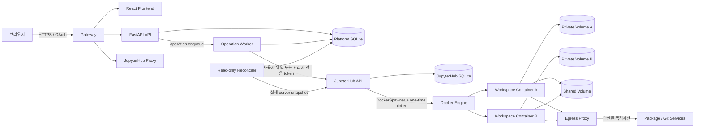

# Team Workspace Platform

팀원이 웹 포털에서 자신의 격리된 Jupyter 개발환경을 만들고 운영할 수 있는
셀프호스팅 플랫폼입니다. React 포털, FastAPI 제어면, JupyterHub 실행면과 Docker
Compose를 결합해 소규모 팀이 하나의 Linux 호스트에서 개발환경을 일관되게 제공하는 것을
목표로 합니다.

> **현재 상태: v0.1.2 Technical Preview**
>
> 로컬 통합환경과 `cyberailabs.team` 단일 호스트 운영 구성을 함께 제공합니다. 운영 구성도
> 조직의 TLS 인증서, 접근 CIDR, VIP/NAT와 백업 책임을 대신하지 않으므로 실제 공개 전에는
> 이 문서의 [운영 준비 조건](#운영-준비-조건)을 반드시 확인하세요.

## 왜 이 프로젝트를 만들었나

작은 개발·데이터·AI 팀도 구성원마다 재현 가능한 개발환경, 자원 제한, 영속 저장공간과
관리자 가시성이 필요합니다. 하지만 Kubernetes 기반 플랫폼은 초기 규모에 비해 운영
비용이 클 수 있고, JupyterHub만 단독으로 사용하면 조직별 승인·할당·감사·삭제 정책을
포털에서 통합하기 어렵습니다.

Team Workspace Platform은 다음과 같은 팀을 대상으로 합니다.

- 약 10명 내외의 상호 신뢰하는 팀
- 한 호스트에서 시작하되 향후 Kubernetes 전환 가능성을 남기려는 팀
- 사용자별 코드와 데이터는 분리하고 명시적인 공유 디렉터리만 함께 쓰려는 팀
- 인터넷 전체가 아니라 승인된 패키지·Git 목적지만 개발환경에서 허용하려는 팀
- CPU·메모리 예산과 실행 중인 환경을 관리자가 한 화면에서 관리하려는 팀

반대로 불특정 다수의 공개 사용자, 강한 사용자 간 네트워크 격리, 다중 호스트 HA, GPU
스케줄링이 즉시 필요한 환경에는 현재 버전이 적합하지 않습니다. 이 경우 KubeSpawner와
Kubernetes NetworkPolicy·ResourceQuota를 사용하는 구성이 더 적합합니다.

## 주요 기능

### 사용자 기능

- JupyterHub NativeAuthenticator 기반 ID/password 로그인과 관리자 가입 승인
- 웹에서 개인 개발환경 생성·시작·중지·재시작·삭제 및 JupyterLab 열기
- 환경 이름 직접 지정 또는 `환경 N` 기본 이름 자동 할당
- Python 3.12/3.13과 관리자가 승인한 CPU·메모리 값 독립 선택
- 사용자별 최대 5개 workspace와 전체 active workspace 상한
- workspace별 private volume과 모든 팀원이 함께 쓰는 `/home/jovyan/shared`
- 사용자 공통 및 workspace별 환경변수 생성·수정·삭제
- 일반 환경변수와 AES-GCM으로 암호화해 저장하는 write-only 비밀 값 구분
- 실행 중 환경변수 변경 시 재실행 필요 안내 및 즉시 재실행 선택
- 생성·시작·중지·재시작·삭제 진행률과 실패 원인 표시

### 관리자 기능

- 관리자 전용 메뉴와 별도 운영·프로필·감사 탭
- 전체 사용자 workspace 조회, 상태 확인, 시작·중지·재시작·삭제 및 접속
- 생성된 workspace 수, 실제 실행 수와 예약된 자원 확인
- 전체 CPU·메모리 예산과 사용자에게 노출할 CPU·메모리 값 직접 추가·삭제
- 검증된 runtime 조합을 참조하는 논리 profile 생성·수정·비공개 처리
- 검증된 Python runtime × 승인 CPU × 승인 메모리 전체 조합 자동 생성
- cross-user 작업과 설정 변경을 포함한 감사 이벤트 조회

## 기본 설계 방향

### 1. 포털은 제어면, JupyterHub는 실행 상태의 원천

브라우저는 FastAPI만 호출하고 FastAPI가 사용자·workspace·quota·operation·감사를
관리합니다. 실제 Jupyter server 상태와 URL은 JupyterHub가 소유합니다. worker는 durable
operation을 처리하고 reconciler는 Hub의 실제 상태를 주기적으로 읽어 SQLite 상태와
수렴시킵니다.

### 2. 사용자 입력보다 검증된 실행 정책을 우선

사용자는 임의 Docker image, command, volume, network 또는 capability를 제출할 수 없습니다.
Python 이미지·커널·명령·mount는 배포된 immutable runtime profile로 고정됩니다. 관리자는
호스트 hard ceiling 안에서 CPU와 메모리 숫자를 추가할 수 있고, API는 각 Python runtime과의
파생 조합을 digest로 고정합니다. JupyterHub는 짧은 일회성 spawn ticket, 원본 runtime
digest, 파생 CPU·메모리와 실행 상한을 독립적으로 재검증한 뒤에만 container를 생성합니다.

### 3. 최소 권한과 자격증명 분리

- 비밀번호와 password hash는 JupyterHub만 보유합니다.
- 일반 lifecycle은 로그인 사용자의 `servers!user` 위임 OAuth token을 사용합니다.
- 관리자 cross-user lifecycle token은 API나 브라우저가 아니라 worker에만 전달합니다.
- read-only reconciler와 volume 작업 agent는 서로 다른 권한과 credential을 사용합니다.
- 사용자 container에는 Docker socket, host path와 control-plane network를 제공하지 않습니다.

### 4. 비동기 작업과 실패 복구를 데이터로 관리

생성·시작·중지·재시작·삭제는 즉시 완료됐다고 가정하지 않고 durable operation으로
기록합니다. 요청에는 idempotency key를 사용하고, worker lease·제한된 재시도·상태
reconciliation으로 응답 유실이나 process 재시작 뒤에도 같은 작업을 이어갑니다.

### 5. 데이터 수명주기와 compute 수명주기 분리

workspace를 중지하면 container만 제거되고 private volume은 유지됩니다. 삭제는 먼저 새
실행과 launch를 차단한 뒤 Hub record를 제거하고, 정확히 해당 workspace의 private volume만
wipe/recreate한 다음 slot을 다시 사용할 수 있게 합니다. shared volume은 workspace 삭제와
무관하게 유지됩니다.

### 6. 실패 시 안전한 쪽으로 닫기

profile digest, OAuth owner, HMAC ticket, network, volume label, 자원 예산 또는 상태 freshness를
확인할 수 없으면 새 spawn을 허용하지 않습니다. Hub 장애를 `STOPPED`로 추정하지 않고
`stale/unknown`으로 표시합니다.

## 아키텍처



### 구성요소

| 구성요소 | 역할 |
| --- | --- |
| `gateway` | 유일한 ingress, TLS·Host routing·WebSocket·요청 제한 |
| `frontend` | React 기반 사용자 포털과 관리자 콘솔 |
| `api` | 인증 session, workspace·profile·환경변수·감사 API |
| `worker` | durable lifecycle operation과 관리자 cross-user 작업 처리 |
| `reconciler` | JupyterHub 실제 상태를 읽어 drift와 freshness 반영 |
| `jupyterhub` | 로그인, RBAC, named server, proxy와 DockerSpawner |
| `egress-proxy` | 승인된 패키지·Git 목적지만 중계 |
| `migrate` | Platform DB Alembic migration one-shot job |
| `bootstrap-profile` | 검증된 immutable runtime profile을 DB에 반영 |

동적 workspace container는 Compose service로 고정 등록하지 않습니다. JupyterHub가 필요할
때 만들고 중지하며, 각 container에는 owner-bound private volume 하나와 shared volume
하나만 연결합니다.

## 주요 동작 흐름

### 로그인과 사용자 준비

1. 사용자가 JupyterHub에 ID/password로 가입합니다.
2. JupyterHub 관리자가 실제 팀원 계정을 승인합니다.
3. 사용자가 포털 OAuth 로그인을 완료하면 Platform DB에 `PROVISIONING` 사용자로 등록됩니다.
4. 로컬 개발 모드에서는 사용자가 포털에서 개인 volume 준비를 요청합니다.
5. 정확히 5개의 owner-bound volume slot이 검증되면 사용자가 `ACTIVE`가 됩니다.

포털의 **로그아웃**은 Platform session과 저장된 OAuth token을 먼저 폐기한 뒤 브라우저를
JupyterHub `/hub/logout`으로 이동해 Hub 로그인 cookie도 제거합니다. 따라서 다음 로그인은
이전 계정을 자동 재사용하지 않고 다시 ID/password 확인을 거칩니다. 로그아웃은 실행 중인
workspace를 중지하거나 삭제하지 않습니다.

### workspace 생성과 실행

1. 사용자가 이름, Python, CPU와 메모리를 선택하면 API가 free volume slot을 예약하고
   workspace를 **중지됨** 상태로 만듭니다. 이 단계는 실행 CPU/RAM을 예약하지 않습니다.
2. 사용자는 생성된 환경 카드에서 일반/비밀 환경변수를 설정합니다.
3. 사용자가 시작하면 API가 aggregate CPU/RAM 예산을 하나의 SQLite transaction에서 검사합니다.
4. worker가 일회성 spawn authorization을 만들고 사용자 권한으로 Hub에 시작을 요청합니다.
5. Hub가 ticket, 원본·파생 profile digest, 자원 상한, owner, slot, network와 volume 계약을
   다시 검사합니다.
6. 실제 server가 ready가 되면 포털이 진행률과 token 없는 Jupyter URL을 표시합니다.

### 환경변수

사용자 공통 값 위에 workspace별 값이 같은 key를 덮어씁니다. 비밀 값은 API에서 다시
읽을 수 없으며 로그·감사 metadata·Docker label·Hub user options에 원문을 남기지 않습니다.
다만 실행 중인 process가 사용하려면 최종 값은 container의 process environment에 존재하므로,
host root나 Docker daemon 침해까지 막는 secret manager로 간주해서는 안 됩니다.

실행 중 값을 변경해도 hot-apply하지 않습니다. workspace에 `restart_required`를 표시하고
명시적인 재실행에서 새 environment snapshot을 적용합니다.

### 삭제

삭제는 단순 DB row 제거가 아닙니다. tombstone → Hub stop/remove → `NOT_FOUND` 확인 → exact
private volume wipe → 빈 volume 재생성·검증 → archive 순서로 진행합니다. 각 단계는 durable
checkpoint와 stable deletion ID에 결속되어 agent나 worker가 중간에 종료되어도 제한된
재시도로 수렴합니다. 삭제된 private 데이터는 backup 없이는 복구할 수 없습니다.

## 저장공간과 공유 디렉터리

- private: `/home/jovyan/work`
- shared: `/home/jovyan/shared`
- JupyterLab 시작 위치: `/home/jovyan`, 기본 화면은 private work 디렉터리

private volume은 다른 workspace에 mount되지 않습니다. shared volume은 모든 팀원이 읽고
수정·삭제할 수 있는 공동 신뢰 영역이며 협업용 `umask 0002`와 setgid group을 사용합니다.
중요 자료는 Git 또는 별도 backup으로 보호하고, secret·개인 데이터·자동 실행되는 Jupyter
설정은 shared에 두지 않는 것을 권장합니다.

현재 기본 storage mode는 사용자별 hard quota를 적용하지 않습니다. UI는 이를
`개별 하드 제한 없음 (호스트 가용량 공유)`로 표시합니다. 따라서 host disk·inode 감시,
임계치 경보, control-plane 예약 공간과 backup/restore 시험이 운영 필수입니다.

## 네트워크와 보안 경계

사용자 실행망은 Compose가 소유하는 `internal` bridge이며 IPv6 endpoint와 외부 gateway를
비활성화합니다. 플랫폼은 host의 `DOCKER-USER` 방화벽 규칙을 설치하거나 가용성에
의존하지 않습니다. 사용자 container의 직접 인터넷·사내망 연결은 차단하고, 승인된
package/Git 목적지만 dual-homed egress proxy를 통해 접근합니다.

현재 신뢰 모델상 같은 실행 bridge의 사용자 container끼리 열린 network port에는 접근할
수 있습니다. 파일은 private mount namespace로 분리되지만 Kubernetes NetworkPolicy 수준의
east-west 격리는 제공하지 않습니다. 상호 불신 사용자나 민감 workload가 들어오면
Kubernetes 전환이 필요합니다.

가장 강한 브라우저 격리는 portal과 사용자 실행 콘텐츠를 서로 다른 registrable domain으로
분리하는 방식입니다. 이 저장소의 `cyberailabs.team` 운영 구성은 부서 전용·상호 신뢰 팀이라는
전제 아래 같은 registrable domain 사용을 [ADR-0009](docs/adr/0009-cyberailabs-production-domain.md)로
명시 승인했습니다. 포털은 `platform.cyberailabs.team`, Hub는 apex, 사용자 서버는
`<username>.cyberailabs.team`으로 origin을 분리하고 `__Host-` cookie와 exact Origin/CSRF를
유지하지만, 별도 registrable domain보다 공급망/Notebook JavaScript 방어 심도가 낮습니다.

자세한 위협 모델은 [MVP 아키텍처](docs/architecture/jupyterhub-mvp.md)와
[ADR-0006](docs/adr/0006-trusted-network-shared-storage.md)을 참고하세요.

## 기술 스택

| 영역 | 기술 |
| --- | --- |
| Frontend | React, TypeScript, Vite |
| Backend | FastAPI, SQLAlchemy, Alembic |
| Database | SQLite |
| Runtime | JupyterHub 5.5, DockerSpawner, JupyterLab |
| Deployment | Docker Compose, Nginx Gateway |
| Authentication | NativeAuthenticator, JupyterHub OAuth |
| Egress | Squid allowlist proxy |

## 빠른 시작

### 요구사항

- Linux
- Docker Engine 28 이상
- Docker Compose v2
- Python 3.10 이상
- OpenSSL

플랫폼 자체 host 방화벽 규칙이나 sudo 설정은 필요하지 않습니다. 로컬 기본 구성은
`127.0.0.1:8080`에만 HTTP로 공개됩니다.

### 1. 로컬 설정과 secret 생성

```bash
make init-local
```

생성된 `.env`, `secrets/`, `.runtime/`은 Git에 포함하지 마세요. 예제 secret을 실제 환경에
재사용해서도 안 됩니다.

더 큰 호스트에서는 `.env`의 다음 hard ceiling을 먼저 조정할 수 있습니다. API와 Hub가 같은
값을 받아야 하며, 웹 관리자는 이 상한 안에서 사용자 CPU·메모리 선택값을 추가합니다.

```dotenv
PLATFORM_WORKSPACE_CPU_BUDGET_MILLICORES=16000
PLATFORM_WORKSPACE_MEMORY_BUDGET_MB=32768
```

### 2. 빌드 및 시작

```bash
make up
make ps
```

### 3. 최초 관리자 등록

1. `http://hub.localhost:8080/hub/signup`에서 `.env`의 관리자 ID로 가입합니다.
2. 12자 이상의 고유한 비밀번호를 직접 설정합니다. 기본 관리자 비밀번호는 없습니다.
3. 팀원이 가입하면 `http://hub.localhost:8080/hub/authorize`에서 승인합니다.
4. 온보딩이 끝나면 `.env`의 `NATIVE_ENABLE_SIGNUP=false`로 바꾸고 Hub를 재생성합니다.

```bash
docker compose up -d --force-recreate jupyterhub
```

### 4. 포털 로그인과 개인 공간 준비

`http://platform.localhost:8080`에서 로그인한 뒤 **개인 개발공간 준비**를 실행합니다.
준비가 완료되면 Python, CPU, 메모리를 선택해 workspace를 만들 수 있습니다.

웹 프로비저닝이 실패했을 때만 다음 CLI를 복구 경로로 사용합니다.

```bash
make list-users
make provision-user USER_ID=<표시된-UUID> USERNAME=<Hub-ID>
```

### 5. 종료

```bash
make down
```

container와 network만 제거하며 Platform DB, Hub DB와 사용자 volume은 보존합니다.

## 프로필과 자원 정책

로컬 catalog는 시작값으로 다음 18개 조합을 제공합니다.

- Python: 3.12.13, 3.13.14
- CPU: 1, 2, 4 core
- Memory: 1, 2, 4 GiB

관리자는 **자원 선택 정책**에서 호스트 hard ceiling 이하의 CPU core와 메모리 MB 값을 직접
추가하거나 제거할 수 있습니다. 저장하면 검증된 각 Python runtime에 대해 CPU × 메모리
조합이 자동 생성되어 생성 화면에 나타납니다. 예를 들어 ceiling이 허용하면 `8 core`와
`16384 MB`를 소스 수정 없이 추가할 수 있습니다. 이 동적 조합도 기존 image·kernel·command·
mount를 그대로 상속하며 Hub가 파생 digest와 상한을 검증합니다. 새로운 Python/image 자체는
여전히 코드 검토, profile policy 변경과 실제 image 검증을 거쳐 배포해야 합니다.

```bash
make profile-matrix-check
make profile-image-check
make profile-deploy
```

`profile-deploy`는 실행 중인 single-user container가 있으면 거부하며, live DB snapshot에서
migration/profile import를 먼저 연습한 뒤 제어면을 순서대로 교체합니다.

## 로컬 HTTPS 도메인 검증

운영 DNS를 변경하기 전에 loopback에서 TLS SNI, OAuth callback, Secure cookie, 사용자별
subdomain과 WebSocket을 검증할 수 있습니다. 실제 조직 도메인 대신 검증 전용 도메인을
설정하고, 생성된 로컬 CA는 격리된 테스트 브라우저 profile에서만 신뢰하세요.

```bash
make domain-test-tls
make domain-test-preflight USERS=platform-admin,alice
make domain-test-up USERS=platform-admin,alice
```

이 전환기는 실행 workspace나 진행 중인 operation이 있으면 중단합니다. 전환 직전 Platform
DB와 JupyterHub DB를 SQLite online backup API로 함께 저장하고 새 schema migration을 복제
DB에서 먼저 연습합니다. 실패 시 DB를 자동으로 덮어쓰지 않고 writer를 중지한 채 복구용
bundle 경로를 출력합니다.

```bash
make domain-test-restore BACKUP=/absolute/path/to/backup-bundle
make domain-test-down
```

상세 인증서·Host·복구 계약은 [Gateway 문서](gateway/README.md)를 참고하세요.

## cyberailabs.team 운영 배포

코드를 내부 운영 서버로 옮긴 뒤의 설치, DNS/VIP, 공인 인증서 발급, 최초 관리자·사용자
생성, 검증, 갱신, backup과 장애 복구 절차는
[운영 서버 전체 배포 가이드](docs/operations/production-deployment-ko.md)를 기준으로 합니다.
기존 `10.155.1.24` 운영 서버에서 새 Git release를 적용할 때는
[Git 업데이트 후 운영 적용 절차](docs/operations/production-update-after-git-ko.md)를 사용합니다.
운영 container만 모두 삭제되어 DB의 실행 의도가 남은 경우도 같은 문서의 offline quiesce
복구 절차를 따르며, DB나 workspace volume을 직접 수정하거나 삭제하지 않습니다.

운영 URL은 다음으로 고정합니다.

- 포털/API: `https://platform.cyberailabs.team`
- JupyterHub: `https://cyberailabs.team`
- 사용자 서버: `https://<username>.cyberailabs.team`

HostingKR 권한 DNS에는 apex(`@`/빈 이름), `platform`, `*` A record가 모두
`123.214.65.254`를 가리켜야 합니다. VIP는 TLS를 종료하지 않고 TCP/443을 production host의
`10.155.1.24:3030`으로 전달합니다. Gateway만 이 host port를 publish하며 플랫폼은 운영
host의 방화벽 규칙을 설치하거나 변경하지 않습니다. 상위 VIP/네트워크 ACL은 별도입니다.

인증서 leaf SAN은 정확히 `cyberailabs.team`, `platform.cyberailabs.team`,
`*.cyberailabs.team`을 포함해야 합니다. wildcard 발급은 DNS-01이 필요합니다. HostingKR에서
수동 발급한다면 `_acme-challenge` TXT 갱신과 만료 전 갱신을 운영 일정으로 관리하고,
가능하면 DNS API가 있는 별도 challenge zone을 CNAME 위임해 자동화합니다.

production host에서만 다음 순서로 실행합니다.

```bash
make production-init
# .env.production의 인증서/키/CIDR 파일 경로와 TLS GID를 검토
make production-preflight
make production-up
make production-ps
```

`production-preflight`는 host가 `10.155.1.24`를 실제 보유하는지, TLS SAN·키·유효기간,
source CIDR allowlist, 실행 중 workspace/다른 local stack 부재, immutable base와 모든 profile
image 계약을 확인합니다. single-user image는 해당 host에서 빌드한 exact Docker image ID로
고정하며, 새 image 배포 때 이전 runtime version을 정책에 남겨 기존 중지 환경도 재시작할 수
있게 합니다.

기존 production DB가 있으면 `production-up`은 writer를 중지하고 두 SQLite DB를 online backup
bundle로 검증한 뒤 migration/profile import를 실행합니다. DB 변경 뒤 실패하면 자동으로
오래된 container를 억지 재기동하지 않고 복구 명령을 출력합니다.

```bash
make production-restore BACKUP=/absolute/path/to/verified-backup-bundle
```

접근 CIDR 파일은 회사/VPN의 실제 source IPv4 CIDR만 한 줄에 하나씩 기록합니다.
`0.0.0.0/0`과 빈 파일은 거부됩니다. VIP가 source NAT를 한다면 Gateway에는 사용자 대신 NAT
주소가 보이므로, source-IP 보존 또는 정확한 SNAT 주소 allowlist를 네트워크 담당자와 먼저
확인해야 합니다.

## 자주 사용하는 명령

| 명령 | 설명 |
| --- | --- |
| `make init-local` | 로컬 `.env`와 secret 초기화 |
| `make up` / `make down` | 로컬 stack 시작 / 종료 |
| `make ps` / `make logs` | 상태 / 로그 확인 |
| `make config` | Compose 설정 렌더링 검증 |
| `make test` | backend·frontend·infra·gateway 전체 검증 |
| `make profile-image-check` | 모든 enabled runtime image 계약 검증 |
| `make profile-deploy` | profile과 관련 제어면의 안전한 배포 |
| `make domain-test-preflight` | HTTPS 도메인 전환 사전검사 |
| `make domain-test-up` | backup 후 domain-test 전환 |
| `make production-init` | 운영 전용 secret/runtime/.env 초기화 |
| `make production-preflight` | 운영 host·TLS·CIDR·image·idle 사전검사 |
| `make production-up` / `make production-down` | backup 포함 운영 stack 시작 / 종료 |
| `make production-bootstrap-admin` | fresh 운영 DB의 최초 관리자 계정 생성 |
| `make production-create-user USERNAME=alice` | signup을 열지 않고 승인 사용자 생성 |

## 저장소 구조

```text
.
├── backend/                 # FastAPI, worker, reconciler, Alembic, tests
├── frontend/                # React 포털과 관리자 UI
├── gateway/                 # local/domain-test/production Nginx 계약
├── infra/
│   ├── jupyterhub/          # Hub 설정, RBAC, spawn/deletion agent, profile policy
│   ├── singleuser/          # JupyterLab image와 runtime 검증기
│   ├── egress-proxy/        # Squid allowlist proxy
│   └── host/                # 선택적 legacy host 도구와 volume helper
├── scripts/                 # 초기화, 배포, backup/restore 전환 도구
├── docs/
│   ├── architecture/        # 전체 아키텍처와 위협 모델
│   └── adr/                 # 주요 설계 결정 기록
├── compose.yaml             # loopback 로컬 통합 구성
├── compose.domain-test.yaml # HTTPS 도메인 사전검증 overlay
└── compose.production.yaml  # cyberailabs.team 단일 호스트 운영 구성
```

## 검증

```bash
make config
make test
```

검증 범위에는 다음이 포함됩니다.

- OAuth/session/CSRF/소유권/idempotency와 관리자 권한
- workspace quota와 aggregate CPU/RAM admission race
- worker/reconciler lease, 재시도와 외부 상태 drift
- 환경변수 암호화·크기 제한·restart snapshot
- profile digest와 Jupyter kernel/interpreter 계약
- private/shared volume mount와 crash-safe 삭제
- execution network, egress와 Gateway TLS/Host 계약
- React API normalizer, 사용자 lifecycle 및 관리자 UI

제한된 sandbox에서 FastAPI TestClient의 로컬 socket 생성이 차단되면 backend pytest가 멈출
수 있습니다. 일반 Linux host, CI 또는 backend test container에서 실행하세요.

## 운영 준비 조건

`compose.yaml`은 loopback 로컬 통합용이고 `compose.production.yaml`은 별도의 운영
stack입니다. 운영 공개 전 최소한 다음 항목을 실제 조직 환경에서 검증해야 합니다.

- ADR-0009의 DNS apex/portal/wildcard, wildcard TLS, HTTPS-only `__Host-` cookie
- digest-pinned image와 dependency·취약점 검토 및 SBOM
- 실제 host 사양에 맞춘 CPU/RAM/동시 실행 부하 시험
- host disk·inode 모니터링, control-plane 예약 공간과 용량 고갈 대응
- Platform DB, Hub DB, private/shared volume과 secret의 backup·복구 훈련
- 승인된 package/Git allowlist와 사내망·metadata·direct egress 차단 시험
- Docker restart 뒤 network/volume 계약 및 전체 브라우저 E2E
- 사용자 보존 기간, 퇴사자 처리, 감사 보존과 삭제 승인 정책

단일 호스트 장애는 전체 서비스 장애가 됩니다. 다중 호스트, HA, GPU, 비신뢰 사용자 간
강한 격리 또는 세밀한 network policy가 필요해지면 Kubernetes 전환을 권장합니다.

## 문서

- [MVP 아키텍처와 위협 모델](docs/architecture/jupyterhub-mvp.md)
- [백엔드 계약](backend/README.md)
- [인프라·JupyterHub 계약](infra/README.md)
- [Gateway와 TLS](gateway/README.md)
- [운영 서버 전체 배포 가이드](docs/operations/production-deployment-ko.md)
- [ADR-0001: JupyterHub 제어면](docs/adr/0001-jupyterhub-control-plane.md)
- [ADR-0006: 신뢰 팀 네트워크와 공유 저장공간](docs/adr/0006-trusted-network-shared-storage.md)
- [ADR-0007: 관리자·환경변수·삭제](docs/adr/0007-admin-runtime-and-environment-management.md)
- [ADR-0008: 파생 자원 프로필·중지 상태 생성](docs/adr/0008-derived-resource-profiles-and-stopped-creation.md)
- [ADR-0009: cyberailabs.team 운영 도메인](docs/adr/0009-cyberailabs-production-domain.md)

## 버전 정책

`v0.1.0`은 단일 호스트 로컬 통합과 핵심 관리 기능을 검증한 첫 공개 preview이고,
`v0.1.1`은 `cyberailabs.team` 운영 배포 계약과 안전한 Git 업데이트 절차를 추가합니다.
`v0.1.2`는 운영 container가 모두 사라진 경우를 위한 백업·감사 기반 offline 복구,
실행 의도 불일치 상태의 UI 복구 동작과 검증된 SQLite runtime을 추가합니다.
`0.x` 기간에는 API, migration과 운영 절차가 호환성 없이 변경될 수 있습니다. runtime profile
같은 실행 정책은 기존 row를 직접 수정하지 않고 새 version으로 추가하는 원칙을 유지합니다.

## 라이선스

이 프로젝트는 [Apache License 2.0](LICENSE)으로 공개됩니다.
