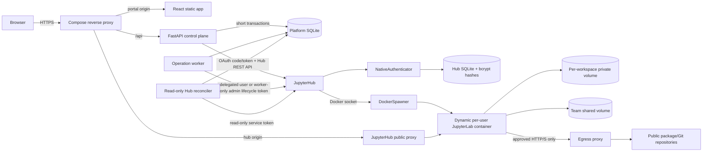
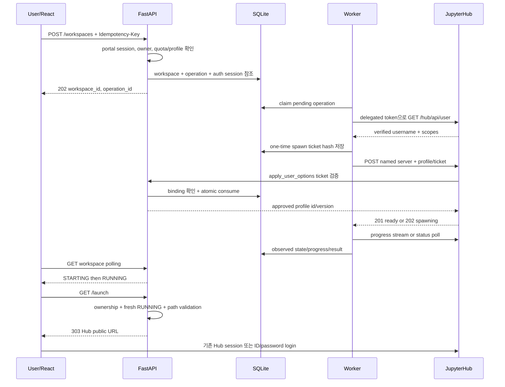

# JupyterHub 개인 개발환경 MVP 설계

- 상태: Accepted (2026-08-10 구현 승인)
- 작성일: 2026-08-06
- 범위: 부서 구성원이 웹 포털에서 개인 Jupyter 개발환경을 생성하고 상태를 확인한 뒤 안전한 URL로 접속하는 첫 단계
- 관련 결정: [ADR-0001: JupyterHub 제어면 연동 방식](../adr/0001-jupyterhub-control-plane.md), [ADR-0003: 로컬 ID/password 단일 인증](../adr/0003-jupyterhub-local-login.md), [ADR-0004: 단일 호스트 Docker Compose](../adr/0004-single-host-compose.md)

## 1. 결론 요약

초기 구조는 **React 포털 → FastAPI 제어면 → JupyterHub REST API → Spawner**로 분리한다.

- React는 JupyterHub API를 직접 호출하지 않는다.
- FastAPI는 사용자 권한, 환경 프로필, 희망 상태, 작업 이력, 감사 로그를 소유한다.
- JupyterHub는 사용자 서버의 실제 생성·중지·프록시·Jupyter 인증을 소유한다.
- 플랫폼 SQLite와 JupyterHub 내부 DB는 별도 파일로 유지하며 서로의 테이블을 직접 읽거나 수정하지 않는다.
- 한 사용자당 환경은 최대 5개로 제한하고, 각각 안전한 내부 이름을 가진 JupyterHub **named server**로 표현한다.
- Jupyter 접속 링크에는 토큰을 넣지 않는다. FastAPI가 소유권과 실행 상태를 확인한 후 JupyterHub server model의 per-user-domain URL을 엄격히 검증해 `303 See Other` 응답을 보낸다.
- 등록 사용자 약 10명, 전체 동시 실행 환경 최대 15개를 대상으로 전용 단일 호스트에서 Docker Compose와 DockerSpawner를 사용한다. 사용자 Jupyter 컨테이너는 Compose가 아니라 DockerSpawner가 동적으로 생성한다.
- 각 환경에는 환경별 private volume과 팀 공용 shared volume을 분리해 mount한다. 사용자 컨테이너의 사내망 접근은 차단하고 package 다운로드에 필요한 인터넷 egress만 허용한다.
- JupyterHub NativeAuthenticator가 ID/password를 한 곳에서 검증하고 bcrypt hash를 Hub DB에 저장한다. FastAPI와 플랫폼 SQLite는 비밀번호나 password hash를 보유하지 않는다.
- FastAPI는 JupyterHub의 외부 OAuth service로 등록한다. 로그인 후 받은 사용자별 OAuth token의 `servers!user` 권한으로 로그인 사용자의 서버만 제어한다.
- React에는 Hub OAuth token 대신 불투명한 `HttpOnly` 포털 세션 cookie만 제공한다.

JupyterHub 공식 문서는 외부 애플리케이션이 REST API로 서버를 시작·중지하는 방식을 지원하고, 시작 요청은 즉시 완료된 `201` 또는 진행 중인 `202`를 반환하며 진행 API를 제공한다고 설명한다. 따라서 FastAPI가 JupyterHub 내부 구현이나 DB에 결합될 필요가 없다. [Starting servers with the JupyterHub API](https://jupyterhub.readthedocs.io/en/stable/tutorial/server-api.html), [JupyterHub REST API](https://jupyterhub.readthedocs.io/en/stable/reference/rest-api.html)

## 2. 목적과 성공 조건

### 2.1 목적

사용자는 포털에서 다음 흐름을 완료할 수 있어야 한다.

1. 자신의 ID와 password로 로그인한다.
2. 승인된 Python·CPU·메모리 조합으로 자신의 개발환경을 중지 상태로 생성한다.
3. 환경변수를 설정한 뒤 시작을 요청하고 `시작 중 → 실행 중` 상태와 진행률을 확인한다.
4. `Jupyter 열기`를 눌러 자신의 JupyterLab으로 이동한다.
5. 환경을 중지하고 다시 시작해도 작업 파일이 보존된다.

관리자는 사용자별 환경 수와 자원 한도를 통제하고 생성·시작·중지·실패 이력을 확인할 수 있어야 한다.

### 2.2 MVP 완료 기준

- 동일 생성 요청을 중복 전송해도 환경이 둘 이상 생기지 않는다.
- 로그인 사용자마다 별도 세션과 내부 사용자 ID가 발급되고 로그아웃·비활성화·만료가 적용된다.
- 다른 사용자의 환경 ID를 추측해도 상태나 URL을 볼 수 없다.
- Hub API 토큰, 사용자 token, 인증 cookie의 **원문**이 URL·React 상태·로그·SQLite에 저장되지 않는다. 서버 세션은 cookie 원문 대신 hash만 저장한다.
- Hub가 `202 Accepted`를 반환해도 화면은 요청 타임아웃 없이 진행 상태를 표시한다.
- FastAPI 또는 작업 프로세스가 재시작된 후 Hub 실제 상태와 플랫폼 상태가 다시 일치한다.
- Hub 장애는 `STOPPED`로 오인되지 않고 `UNKNOWN/stale`로 표시된다.
- 중지 후 재시작 시 사용자 작업공간 파일이 유지된다.
- 사용자당 환경 5개와 전체 active server 15개 제한이 포털과 Hub 양쪽에서 우회되지 않는다.
- 사용자 A의 private volume은 B에게 보이지 않고, 명시적인 shared directory만 공동 읽기·쓰기 가능하다.
- 리버스 프록시를 통한 JupyterLab HTTP와 WebSocket이 모두 동작한다.
- CPU, 메모리, 프로세스 수와 사용자당 환경 수에 상한이 있다.

### 2.3 이번 범위에서 제외

- 사용자가 임의의 컨테이너 이미지, Docker 옵션, 볼륨 경로를 입력하거나 예약된 startup/
  loader/platform 환경변수를 덮어쓰는 기능
- 공유 실행환경·공동 owner·세분화된 shared directory ACL
- 일반 VM·클라우드 인스턴스 관리
- GPU, 다중 노드 스케줄링, 자동 확장, 고가용성
- 파일별 백업 복구
- 브라우저 안 `iframe`으로 Jupyter를 임베드하는 기능

일반 인스턴스 관리는 요구가 구체화될 때 별도 도메인으로 추가한다. 지금 `Workspace`를 모든 미래 인스턴스를 표현하는 범용 테이블로 만들면 서로 다른 수명주기와 보안 정책이 억지로 결합된다.

## 3. 확인된 사실, 가정, 미확정 정보

| 구분 | 내용 | 설계 영향 |
|---|---|---|
| 확인된 사실 | 현재 저장소에는 기존 애플리케이션 코드와 유효한 Git 메타데이터가 없다. | 신규 설계로 시작한다. |
| 확인된 요구 | 사용자별 ID/password 로그인을 사용한다. | JupyterHub를 단일 자격 증명 저장소와 OAuth provider로 둔다. |
| 확인된 사실 | JupyterHub는 named server 시작·중지 REST API와 `ready`, `pending`, `url`, `progress_url`을 포함한 서버 모델을 제공한다. | 공식 API만 사용하는 어댑터를 둔다. |
| 확인된 사실 | JupyterHub RBAC는 서버 관리 권한을 서비스 역할과 scope로 제한할 수 있다. | 전체 관리자 토큰을 사용하지 않는다. |
| 확인된 사실 | JupyterHub 공식 보안 문서는 기본 구성이 반신뢰 사용자용이며, 신뢰하지 않는 사용자 간 보호에는 per-user domain이 필요하다고 명시한다. | 신뢰 수준이 배포 방식과 도메인 구조를 바꾸는 핵심 조건이다. |
| 확인된 사실 | SQLite는 한 DB 파일에서 동시 writer를 하나만 허용하며 네트워크 파일시스템과 많은 동시 writer에는 client/server DB를 권고한다. | 로컬 디스크·짧은 write·단일 worker 조건을 둔다. |
| 확인된 요구 | 등록 사용자는 팀원 약 10명이다. | 단일 노드와 SQLite의 운영 복잡도를 수용할 수 있다. |
| 확인된 요구 | 사용자당 환경 최대 5개, 전체 동시 실행 환경 최대 15개다. | named server와 Hub/플랫폼 이중 quota를 사용한다. |
| 확인된 요구 | Docker Compose로 배포한다. | 단일 호스트 DockerSpawner와 정적 Compose 서비스를 사용한다. |
| 확인된 요구 | 팀원은 서로 신뢰하지만 private code/data는 격리하고 별도 shared directory로 공유한다. | 환경별 private volume과 shared volume을 분리한다. shared 영역은 공동 신뢰 경계다. |
| 확인된 요구 | 사용자 환경은 사내 시스템에 접근하지 않고 package 다운로드용 인터넷은 필요하다. | Compose internal/isolated network와 egress proxy로 direct route를 없애고 승인된 외부 목적지만 허용한다. |
| 확인된 요구 | 사용자와 관리자가 포털에서 환경을 삭제한다. | tombstone 뒤 privileged agent가 exact private slot만 crash-safe wipe/recreate하며 shared volume은 거부한다. |
| 확인된 요구 | 포털에서 생성 진행 상태를 제공한다. | native spawn 링크만으로 범위를 축소하지 않고 durable operation을 구현한다. |
| 확인된 사실 | 기존 Kubernetes가 있지만 MVP는 Compose로 시작한다. | K8s는 격리·용량 조건이 바뀔 때 현실적인 전환 대안이다. |
| 미확정 | 환경당 CPU·메모리·디스크 요구량 | host 사양과 환경별 quota 수치는 부하 시험 전 확정할 수 없다. |
| 미확정 | backup·보존 기간 | 수동 삭제와 별개로 복구 목표를 정해야 한다. |

공식 문서상 JupyterHub는 “modestly sized groups of semi-trusted users”를 기본 대상으로 하며, 신뢰하지 않는 사용자 사이의 보호는 기본 구성에서 보장하지 않는다. 이 사실 때문에 “부서 내부 사용자이니 Docker면 충분하다”는 결론은 사용자 신뢰와 내부망 민감도를 확인하기 전에는 조건부 결론이다. 사람 사이의 조직적 신뢰와 런타임 신뢰는 별개다. 계정 탈취, 악성 패키지, 실수 가능성 때문에 사용자 코드는 항상 비신뢰 코드로 취급한다. [JupyterHub Security Overview](https://jupyterhub.readthedocs.io/en/stable/explanation/websecurity.html)

## 4. 시스템 구조



### 4.1 구성요소별 책임

| 구성요소 | 소유 책임 | 소유하지 않는 책임 |
|---|---|---|
| React | 환경 목록·상태·진행 표시, 생성/시작/중지 요청, launch 이동 | Hub 토큰, 컨테이너 생성, 권한 판단 |
| FastAPI | 플랫폼 인증/인가, quota, 프로필 검증, workspace/operation/audit API, launch 권한 검사 | Jupyter 프로세스와 프록시 상태의 직접 관리 |
| Operation worker | Hub lifecycle 명령 실행과 durable retry | 사용자 요청 인증, 주기적 전체 Hub 열거 |
| Read-only reconciler | Hub 전체 snapshot, 실제 상태·freshness·외부 변경 감사 갱신 | server start/stop, notebook 접근, portal session·환경 secret 복호화 |
| Platform SQLite | 사용자 매핑, 승인 프로필, 희망/최근 관찰 상태, 작업·감사 기록 | JupyterHub 내부 사용자·프록시·Spawner 상태 |
| JupyterHub | ID/password 인증, 포털 OAuth provider, 사용자 서버 수명주기, Hub RBAC, Jupyter 인증, 프록시 경로 | 포털 제품 정책과 일반 인스턴스 도메인 |
| NativeAuthenticator | bcrypt password hash, signup/승인, password 변경·reset, 로그인 실패 제한 | 포털 세션과 workspace 정책 |
| Spawner | 사용자별 실행 단위, 자원 한도, 영속 볼륨 연결 | 포털 사용자 권한 |
| Compose execution network / egress proxy | direct route·사용자 DNS 제거, 승인 외부 package 목적지 중계, 사내망·metadata 차단 | 사용자별 workspace 권한과 user-to-user port 격리 |
| Reverse proxy / ingress | TLS, 라우팅, WebSocket, 요청 크기·시간 제한 | 애플리케이션 소유권 검사 |

### 4.2 공개·내부 네트워크 경계

권장 공개 주소는 역할별로 분리한다.

- 포털: `https://platform.example.com`
- Hub control: `https://hub.example.net`
- 사용자 server: `https://<hub-user-subdomain>.hub.example.net/...`
- Hub 내부 API: Docker 내부 네트워크 주소로만 접근하고 외부에 공개하지 않음

포털의 민감한 cookie가 사용자 코드 origin으로 전달되지 않도록 포털과 Hub를 분리하고, private code/data의 브라우저 수준 격리를 위해 JupyterHub per-user domain을 적용한다.

```python
c.JupyterHub.subdomain_host = "https://hub.example.net"
c.JupyterHub.subdomain_hook = "idna"
c.JupyterHub.cookie_host_prefix_enabled = True
```

위 이름은 placeholder지만 **portal과 user-content의 registrable domain은 달라야 한다**(`example.com` 대 `example.net`). wildcard DNS `*.hub.example.net`을 gateway로 연결하고 TLS 인증서 SAN에는 Hub apex `hub.example.net`과 wildcard를 모두 넣는다. 모든 portal 민감 cookie는 `__Host-` prefix, `Secure`, `Path=/`, Domain 생략을 강제하고, session cookie에는 `HttpOnly`도 적용한다. React와 FastAPI는 같은 portal origin을 사용해 CORS와 브라우저 token 보관을 줄인다. 공식 문서가 사용자 server 간 신뢰성 있는 웹 격리는 subdomain이 유일한 방법이며 이를 쓰지 않으면 사용자 간 보호를 보장하지 않는다고 명시하므로, DNS/TLS 또는 별도 portal domain 제약으로 이 구조를 적용하지 못하면 명시적 위험 승인 없이는 팀 데이터 공개를 보류한다. [JupyterHub Security Overview](https://jupyterhub.readthedocs.io/en/stable/explanation/websecurity.html#enable-user-subdomains)

Docker 네트워크도 분리한다.

- `edge`: reverse proxy가 포털과 Hub 공개 프록시에 접근
- `control`: FastAPI/worker/reconciler가 Hub 내부 API에 접근
- `jupyter`: Hub proxy와 사용자 컨테이너, egress-proxy가 통신
- 사용자 컨테이너는 `control`에 연결하지 않음

## 5. 핵심 설계 결정

### 5.1 FastAPI는 제어면, JupyterHub는 실행면이다

FastAPI는 JupyterHub의 DB나 Docker API를 직접 다루지 않고 `JupyterHubProvider` 인터페이스 뒤에서 Hub REST API만 호출한다.

```text
JupyterHubProvider
  resolve_principal(user_oauth_token)
  request_start(principal, server_name, approved_profile, spawn_ticket)
  request_stop(principal, server_name)
  get_server(principal, server_name)
  stream_or_poll_progress(principal, server_name)
```

`principal`은 로그인 callback과 각 Hub 명령 직전에 사용자 OAuth token을 `/hub/api/user`로 검증해 얻으며, 클라이언트가 보낸 username이 아니다. Hub 로그인 때 사용자가 이미 생성되므로 FastAPI에 `ensure_user`나 `admin:users` 권한을 주지 않는다. 이 경계는 향후 KubeSpawner나 다른 Hub로 이동해도 포털 API와 도메인 모델을 유지하게 한다. 단, 미래의 일반 VM 공급자를 억지로 같은 `JupyterHubProvider`에 넣지는 않는다.

### 5.2 MVP에서도 named server를 사용한다

사용자당 최대 5개 환경이 필요하므로 named server를 채택한다. 플랫폼이 생성한 `ws-<opaque-id>`를 server name으로 사용하고 사용자가 이름을 직접 정하지 않는다. DockerSpawner container 이름에는 username과 servername을 포함하고, private volume은 DB가 배정한 pre-provisioned username/slot 매핑만 사용한다.

```python
c.JupyterHub.allow_named_servers = True
c.JupyterHub.named_server_limit_per_user = 5
c.JupyterHub.active_server_limit = 15
```

`named_server_limit_per_user`는 Hub에 존재하는 사용자별 named server record 수를, `active_server_limit`는 spawning부터 완전 정지 전까지 Hub 전체 active server 수를 제한한다. 플랫폼 DB도 한 사용자당 미삭제 workspace 총 5개를 transaction 안에서 검사한다. Hub가 capacity 때문에 반환하는 `429`는 `operation.status=FAILED`, `error_code=CAPACITY_LIMIT`으로 매핑하고 자동 재시도하지 않으며, 용량이 생긴 뒤 사용자가 다시 요청하게 한다. 동시에 spawn하는 수를 제한하는 `concurrent_spawn_limit` 값은 host 부하 시험 후 15보다 낮게 별도 설정한다. [JupyterHub application configuration](https://jupyterhub.readthedocs.io/en/stable/reference/api/app.html)

default server `""`가 사용자당 named server 한도를 우회하지 않도록 `pre_spawn_hook`에서 admin을 포함한 모든 사용자의 빈 server name을 거부한다. 이 quota에는 admin 예외를 두지 않는다. Spawner image/resource/volume은 고정된 profile resolver만 설정하고 native options form은 비활성화한다.

포털이 승인한 spawn만 실행되도록 다음 이중 검증을 둔다.

1. worker가 workspace lock/`spec_version`을 확인해 `desired_state=RUNNING`일 때만 username, servername, workspace, operation/attempt, immutable profile ID/version/config digest, private volume slot, user/workspace 환경변수 generation과 effective-map HMAC, 짧은 만료에 결속된 무작위 one-time `spawn_ticket`을 만든다. platform DB에는 ticket hash와 암호화된 환경 snapshot만 저장한다.
2. worker가 사용자 OAuth token으로 Hub start API를 호출하며 `user_options`에는 `profile_id`, `profile_version`, `spawn_ticket`만 보낸다. ticket은 브라우저에 전달하지 않는다.
3. JupyterHub 5.5의 async `Spawner.apply_user_options`가 control network의 FastAPI 내부 endpoint에서 ticket을 원자적으로 consume한다. 요청은 Hub/API에만 mount한 별도 key로 method·path·body hash·짧은 timestamp·nonce를 HMAC 서명하며 API는 clock skew와 nonce 재사용을 거부한다. 정확한 username/servername/profile ID·version·config digest/operation/attempt/private-volume-slot/environment digest·generation과 일치하지 않거나 서명 오류, 만료·재사용·추가 option, 변경된 `spec_version`, `desired_state != RUNNING`, `users.status != ACTIVE` 중 하나라도 있으면 실패 시 닫힌다. validator는 `token owner → platform user → workspace owner → volume-slot owner`가 모두 같은지도 별도 join으로 확인한다.
4. Hub는 검증된 `(profile_id, profile_version, config_digest)`를 로컬 allowlist의 원본 Python runtime에 결속한다. image, command, kernel, mount와 containment 설정은 원본 profile에서만 가져온다. 관리자가 hard ceiling 안에서 추가한 CPU/RAM 조합은 API가 원본 runtime에서 파생한 digest와 자원값을 ticket에 결속하고, Hub가 같은 알고리즘으로 ID/digest를 재구성하며 별도 실행 상한까지 검사한다. 브라우저 요청 body의 image, resource 값, host path는 사용하지 않는다. 환경변수는 별도 effective map만 검증하고 platform HOME/proxy/bootstrap 값이 마지막 merge로 우선한다.
5. `pre_spawn_hook`은 container 생성 직전에 operation/attempt와 승인 당시 workspace spec version/volume slot/environment digest·generation, `users.status=ACTIVE` 및 위 owner 불변식을 원문 환경변수 없는 내부 API check로 다시 검증한다. 비활성 사용자, `desired_state != RUNNING` 또는 spec/owner 변경이면 중단하고, 그 뒤 ticket marker, `ws-<opaque-id>` 이름과 non-default server를 모든 사용자에 대해 다시 확인한다. JupyterHub 5.5에는 `post_spawn_hook`이 없으므로 전용 DockerSpawner wrapper가 Docker `create_object` 직후와 모든 start 예외에서 Hub 메모리의 user 환경 snapshot을 지운다. pre-spawn 거부와 post-stop도 같은 정리를 수행하며 다음 start/restart는 새 ticket을 필요로 한다.

JupyterHub가 `user_options`를 Hub DB에 보존하므로 ticket은 수십 초의 단일 사용 값으로 만들고 소비 직후 권한을 잃게 하며 로그에서 redaction한다. worker가 중간에 죽으면 기존 ticket을 재사용하지 않는다. 같은 operation의 새 attempt 행을 만들면서 이전 미소비 ticket을 원자적으로 revoke한 뒤 새 ticket으로 다시 시도한다. [JupyterHub Spawner user options](https://jupyterhub.readthedocs.io/en/stable/api/spawner.html)

JupyterHub 5.5는 spawn hook 전에 named-spawner record를 만들 수 있다. 따라서 ticket 검증은 **container 실행**을 막지만 미승인 record 자체의 생성을 완전히 막지는 않는다. 사용자가 ticket 없는 이름을 반복 요청하면 다른 사용자를 침해하지는 못해도 자신의 Hub record 한도를 소진할 수 있다. read-only reconciler는 platform workspace에 매핑된 record만 DB에 반영하며 미등록 record를 자동 삭제하지 않는다. private admin cleanup runbook이 Hub DB/실행 상태를 다시 확인해 exact record만 remove한다. record 생성 전 차단이 필수가 되면 custom Hub handler라는 더 큰 변경이 필요하므로 MVP에서는 이 self-denial 잔여 위험을 수용한다.

public gateway는 포털 OAuth·login·logout·password change·single-user 접근에 필요한 Hub 경로만 허용하고, `/hub/signup`은 통제된 온보딩 기간에만 연다. native `/hub/spawn`, `/hub/token` UI와 mutating Hub REST API는 노출하지 않는다. 다만 path 차단은 보안 경계가 아니라 실수 방지 수단이다. 실제 start 방어선은 spawn ticket/hook와 Hub의 5/15 limit다. 사용자는 JupyterHub 5.5의 `servers!user` 권한상 자기 server를 직접 stop하거나 Hub named-server record를 remove할 수 있으므로, reconciler는 이를 `audit_events.action=EXTERNAL_CHANGE`로 기록하고 실제 `observed_state`에 반영한다. 이 Hub record remove만으로 platform workspace/private volume이 삭제되지는 않는다. 포털의 명시적 DELETE만 tombstone과 privileged exact-volume wipe를 시작한다. 관리자의 다른 사용자 lifecycle은 worker-only `admin:servers` token을 사용하고, notebook 접속은 token 없는 canonical redirect 뒤 관리자 Hub browser session으로 인증한다.

근거는 다음과 같다.

- 플랫폼 `workspace_id`와 Hub 실행 단위를 명시적으로 매핑할 수 있다.
- 확인된 사용자당 최대 5개 환경을 각각 독립적으로 시작·중지할 수 있다.
- 기본 서버 `""`에 의존하는 URL·상태 처리의 모호성을 줄인다.

반대 근거는 container/volume 이름, quota와 orphan reconciliation의 테스트 표면이 늘어난다는 점이다. 하지만 최대 5개 요구가 확정돼 default server 하나만 사용하는 대안은 요구를 충족하지 못한다.

### 5.3 희망 상태와 관찰 상태를 분리한다

플랫폼 DB는 실제 실행 상태의 원천이 아니다. JupyterHub가 실제 상태의 원천이고 플랫폼은 마지막 관찰 결과를 캐시한다.

- `desired_state`: `RUNNING | STOPPED | DELETED`
- `observed_state`: `NOT_FOUND | STARTING | RUNNING | STOPPING | STOPPED | FAILED | UNKNOWN`
- `operation.status`: `PENDING | RUNNING | SUCCEEDED | FAILED | AUTH_REQUIRED | CANCELLED`

| Hub 관찰 | 플랫폼 관찰 상태 |
|---|---|
| 서버 모델 없음 | `NOT_FOUND` |
| `pending=spawn` | `STARTING` |
| `ready=true` | `RUNNING` |
| stop 관련 pending | `STOPPING` |
| stopped server 모델 | `STOPPED` |
| 명시적 spawn 실패 | `FAILED` |
| Hub timeout/연결 실패 | `UNKNOWN`, `stale=true` |

Hub 연결 실패를 `STOPPED`로 바꾸지 않는다. 명령 timeout 뒤에도 실제 Hub 작업은 성공할 수 있으므로 먼저 다시 조회하고, 전송 오류만 제한적으로 재시도한다. 인증 오류나 잘못된 프로필 같은 4xx는 자동 재시도하지 않는다.

`DELETED`는 이미 삭제됐다는 관찰 상태가 아니라 관리자 runbook이 **가장 먼저** 설정하는 삭제 tombstone이다. 같은 `BEGIN IMMEDIATE` transaction에서 `deletion_started_at`, 보안 결속용 `spec_version`과 낙관적 잠금용 `row_version`을 갱신하고 pending start를 취소하며 미소비 spawn ticket을 revoke한다. 이후 일반 start/launch와 ticket consume은 실패 시 닫힌다. 실제 Hub record·container·private volume 제거와 archive는 재시작 가능한 checkpoint 순서로 뒤따른다.

### 5.4 긴 작업은 durable operation으로 다룬다

생성은 storage slot을 원자적으로 배정하고 중지 상태의 terminal CREATE operation을 `202 Accepted`로 반환한다. 시작·중지·재시작·삭제는 `202 Accepted`와 durable `operation_id`를 반환한다. 한 개의 worker가 SQLite의 pending operation을 처리하며 workspace별로 직렬화한다. FastAPI의 메모리 기반 `BackgroundTasks`만 사용하면 프로세스 재시작 시 작업이 사라지므로 MVP 기준으로 채택하지 않는다.

초기 화면은 2초 간격 polling을 사용한다. 실제 사용성 검증 후 필요할 때만 FastAPI가 정제한 SSE를 추가한다. JupyterHub progress API가 반환하는 `html_message`는 브라우저에 전달하거나 렌더링하지 않고 숫자 진행률과 일반 텍스트 메시지만 허용한다.

JupyterHub의 progress API는 `data: {JSON}` 형태의 이벤트 스트림과 최종 `ready`, `url`을 제공한다. [Starting servers with the JupyterHub API](https://jupyterhub.readthedocs.io/en/stable/tutorial/server-api.html)

### 5.5 접속 URL은 자격 증명이 아니다

`GET /api/v1/workspaces/{id}/launch`는 다음 순서로 동작한다.

1. 로그인 사용자와 workspace 소유권을 확인한다.
2. 최근 Hub 관찰 결과가 `RUNNING`인지 확인한다.
3. Hub에서 현재 server model을 다시 조회하고 `full_url`을 검증한다.
4. 검증한 HTTPS URL로 `303 See Other`를 반환한다.
5. 브라우저에 유효한 Hub session이 있으면 바로 열리고, 없으면 NativeAuthenticator의 ID/password 로그인을 거친다.

URL 검증 규칙은 다음과 같다.

- scheme은 `https`, port는 기본 port, user-info/query/fragment는 없어야 한다.
- host는 verified Hub username에 설정된 `subdomain_hook="idna"`를 적용해 계산한 정확한 `<hub-user-subdomain>.hub.example.net`이어야 한다. raw username 보간이나 suffix 일치만으로 허용하지 않는다.
- 경로의 역슬래시, 제어문자, 상위 경로 이동과 중복 encoding을 거부한다.
- 설정된 Hub base path와 기대한 사용자/server path 밖의 경로는 거부한다.
- username이 DNS label 제한을 만족하는지 확인하고 host 계산은 Hub와 동일한 server-side 함수/통합 test를 사용한다.
- URL은 요청 body나 클라이언트 입력에서 받지 않으며 DB cache보다 새 Hub model을 우선한다.
- 쿼리 문자열에 API token을 절대 추가하지 않는다.

공식 문서는 사용자 서버가 `/user/:username[/:servername]` 경로로 라우팅되고, 인증되지 않은 브라우저가 Hub login을 거쳐 원래 요청으로 돌아오는 URL 체계를 설명한다. [JupyterHub URL scheme](https://jupyterhub.readthedocs.io/en/stable/reference/urls.html)

## 6. 인증, 인가, 사용자 매핑

### 6.1 단일 ID/password 저장소

JupyterHub NativeAuthenticator를 유일한 password 검증 주체로 사용한다. ID/password 입력 화면은 Hub origin에서 제공하며 FastAPI와 React는 password를 받지 않는다.

- password hash는 NativeAuthenticator가 JupyterHub SQLite의 `users_info`에 bcrypt 형식으로 저장한다.
- 플랫폼 SQLite에는 normalized Hub username 매핑, 내부 user UUID와 포털 세션만 저장하고 password/password hash 컬럼을 만들지 않는다.
- `DummyAuthenticator`와 모든 사용자가 같은 password를 쓰는 SharedPasswordAuthenticator는 사용하지 않는다.
- 등록 사용자가 10명뿐이므로 self-signup 후 관리자 승인을 사용하고, 전체 온보딩이 끝나면 signup을 닫는다.

NativeAuthenticator는 소규모·중간 규모 Hub를 위한 로컬 signup/authenticator이며 관리자 승인, password 길이·common-password 검사, 실패 로그인 차단을 제공한다. 기본 password 강도 검사는 느슨하므로 설정을 명시해야 한다. [NativeAuthenticator overview](https://native-authenticator.readthedocs.io/), [configuration options](https://native-authenticator.readthedocs.io/en/stable/options.html)

초기 정책은 다음과 같다.

```python
c.JupyterHub.authenticator_class = "native"
c.Authenticator.username_pattern = r"^(?!.*--)[a-z](?:[a-z0-9-]{0,30}[a-z0-9])?$"
c.Authenticator.allow_all = True
c.Authenticator.allow_existing_users = False
c.Authenticator.admin_users = {"platform-admin"}  # 배포 전 실제 bootstrap ID로 고정
c.Authenticator.blocked_users = set()              # offboarding 시 보호된 설정에서 갱신
c.NativeAuthenticator.open_signup = False
c.NativeAuthenticator.enable_signup = True       # 온보딩 종료 후 False
c.NativeAuthenticator.minimum_password_length = 12
c.NativeAuthenticator.check_common_password = True
c.NativeAuthenticator.allowed_failed_logins = 5
c.NativeAuthenticator.seconds_before_next_try = 900
```

username은 기본 정규화 결과인 소문자를 사용하며, 위 규칙으로 영문자로 시작하는 1~32자의 DNS label(`a-z`, `0-9`, 내부 단일 `-`)만 허용한다. 숫자로만 된 이름과 `--`를 금지하지만 launch host는 여전히 raw username이 아니라 Hub와 같은 `idna` hook 결과로 계산하고 허용 경계값을 통합 시험한다. username 변경과 퇴사자 ID 재사용은 MVP에서 금지한다. JupyterHub는 `Authenticator.username_pattern`으로 로그인 이름을 검증할 수 있다. [JupyterHub Authenticator configuration](https://jupyterhub.readthedocs.io/en/stable/reference/authenticators.html)

JupyterHub 5의 `allow_all`은 NativeAuthenticator가 password와 관리자 승인 상태를 성공적으로 검증한 사용자를 Hub의 후속 allow 검사에서 다시 거부하지 않게 한다. NativeAuthenticator의 인증·승인을 우회하는 의미가 아니다. `admin_users`의 정확한 ID는 gateway 공개 전에 설정하고 그 ID가 가장 먼저 signup해야 한다. MVP 조합은 `jupyterhub-nativeauthenticator==1.3.0`과 Python 3.9 이상으로 고정하고 JupyterHub 5.5 통합 시험을 통과시킨다. [NativeAuthenticator on PyPI](https://pypi.org/project/jupyterhub-nativeauthenticator/1.3.0/)

NativeAuthenticator의 실패 횟수 상태는 현재 구현상 Hub process memory에 있어 재시작하면 초기화된다. 따라서 reverse proxy의 IP 기반 로그인 rate limit과 실패 로그인 모니터링을 함께 적용한다. NativeAuthenticator에는 선택형 2FA 기능이 있지만 MVP는 요청대로 ID/password만 사용한다. 조직 차원의 MFA·복구·중앙 퇴사자 처리가 필요해지면 로컬 기능을 개별 확장하기보다 조직 IdP/OIDC 전환을 우선 검토한다.

### 6.2 포털 로그인: JupyterHub OAuth

FastAPI를 `platform-api`라는 externally-managed JupyterHub OAuth service로 등록한다. JupyterHub는 어떤 Authenticator를 쓰더라도 OAuth provider로 동작할 수 있고, 공식 문서에 FastAPI service 예제가 있다. [JupyterHub services](https://jupyterhub.readthedocs.io/en/latest/reference/services.html), [JupyterHub and OAuth](https://jupyterhub.readthedocs.io/en/latest/explanation/oauth.html)

핵심 JupyterHub 설정의 형태는 다음과 같다. secret 값은 설정 파일이나 image가 아니라 Compose secret에서 읽는다.

```python
c.JupyterHub.oauth_token_expires_in = 8 * 60 * 60  # 초기값: 1 근무일
c.JupyterHub.token_expires_in_max_seconds = 8 * 60 * 60  # API 생성 token 무기한 발급 금지
c.JupyterHub.cookie_max_age_days = 8 / 24           # Hub login cookie도 8시간
c.JupyterHub.services = [
    {
        "name": "platform-api",
        "api_token": read_secret("platform_oauth_client_secret"),
        "oauth_client_id": "service-platform-api",
        "oauth_redirect_uri": "https://platform.example.com/api/v1/auth/callback",
        "oauth_client_allowed_scopes": [
            "servers!user",
        ],
        "display": False,
    }
]
```

여기서 `api_token`은 외부 service의 OAuth client secret 역할도 하지만 `platform-api`에는 Hub role을 배정하지 않는다. 따라서 service 자체 credential로 사용자 server를 조작할 수 없고, 실제 명령에는 사용자가 위임한 OAuth token을 사용한다.

2026-08 현재 최신 production release는 JupyterHub 5.5.0이며 Hub의 PKCE 검증은 6.0에 추가될 예정인 기능이다. MVP는 5.5.0을 digest로 고정하고 confidential client secret, exact redirect URI, 일회성 `state`와 callback 결속을 현재 보안 통제로 사용한다. FastAPI는 S256 PKCE parameter도 보내고 verifier를 callback까지 보관하지만 5.5에서는 Hub가 이를 검증하지 않으므로 보안 통제로 계산하지 않는다. JupyterHub 6.x 안정판과 NativeAuthenticator/DockerSpawner/single-user image 호환성이 확인되면 `oauth_require_pkce=True`를 켠다. [JupyterHub releases on PyPI](https://pypi.org/project/jupyterhub/), [JupyterHub PKCE documentation](https://jupyterhub.readthedocs.io/en/latest/explanation/oauth.html#pkce)

OAuth token과 Hub login cookie는 기본값에 맡기지 않고 초기 8시간으로 맞추며 portal session absolute expiry도 이를 넘지 않게 한다. 사용자가 Hub API로 별도 token을 만들더라도 무기한 token이 되지 않도록 같은 최대 수명을 적용한다. 이 값은 JupyterLab 재인증 UX를 pilot에서 확인해 조정한다. OAuth 응답의 `expires_in` 또는 고정 설정에서 실제 만료 시각을 session에 저장하고 worker는 만료가 임박한 token으로 새 operation을 시작하지 않는다. [JupyterHub application configuration](https://jupyterhub.readthedocs.io/en/stable/reference/api/app.html)

```mermaid
sequenceDiagram
    participant B as Browser/React
    participant A as FastAPI
    participant H as JupyterHub OAuth provider
    participant N as NativeAuthenticator
    participant D as Platform SQLite

    B->>A: GET /api/v1/auth/login
    A->>A: state + forward-compatible PKCE verifier 생성
    A-->>B: 302 /hub/api/oauth2/authorize
    B->>H: authorization request
    H->>N: ID/password 검증
    N-->>H: normalized Hub username
    H-->>B: authorization code callback
    B->>A: GET /api/v1/auth/callback?code=...
    A->>H: code 교환
    A->>H: GET /hub/api/user
    H-->>A: username + resolved scopes
    A->>D: absent user를 PROVISIONING으로 insert/기존 상태 확인
    D-->>A: PROVISIONING | ACTIVE | DISABLED
    alt status is DISABLED
        A-->>B: 403, token 폐기; 자동 재활성화 금지
    else allowed platform status
        A->>D: opaque portal session 저장
        A-->>B: Secure HttpOnly host-only session cookie
    end
```

- OAuth redirect URI exact match, 일회성 `state`, pre-auth cookie와 callback 결속
- PKCE S256 parameter는 보내되 Hub 5.5에서는 검증되지 않는다는 잔여 위험 기록
- callback에서 `/hub/api/user`를 호출해 token 소유자와 실제 resolved scopes 확인
- callback user write는 `INSERT ... ON CONFLICT DO NOTHING` 뒤 기존 상태를 읽는 방식으로 수행한다. 신규 사용자만 `PROVISIONING`으로 만들고 `ACTIVE/PROVISIONING`은 유지하며, `DISABLED`는 절대 자동 재활성화하거나 session을 만들지 않는다.
- React의 `localStorage`, `sessionStorage`, URL에 Hub OAuth token 저장 금지
- portal session cookie는 무작위 opaque 값이며 DB에는 원문 대신 hash 저장
- Hub OAuth token은 별도 key와 key ID를 쓰는 인증된 암호화(AEAD)로 서버 측에서만 보관하고 portal session보다 길게 사용하지 않으며 logout/만료 때 로컬 사본을 폐기
- portal session은 `__Host-platform-session`, pre-auth/CSRF cookie도 각각 고정된 `__Host-` 이름을 사용하며 `Secure`, `Path=/`, Domain 생략을 강제한다. session에는 `HttpOnly; SameSite=Lax`, OAuth top-level callback에 필요한 pre-auth cookie에도 `SameSite=Lax`를 적용한다.
- 로그인 직후와 권한 상승 시 session ID 회전
- mutating API에는 CSRF token과 Origin 검증 적용

OAuth BCP의 redirect exact match, state, open redirect 금지 원칙을 적용한다. PKCE 미지원은 JupyterHub 6 안정판 전환 때 제거할 잔여 위험이다. [RFC 9700](https://www.rfc-editor.org/rfc/rfc9700.html)

### 6.3 사용자별 위임 권한

일반 사용자의 생성·조회·시작·중지는 FastAPI service 자체 token이 아니라 로그인 때 발급된 **사용자 OAuth token**으로 호출한다.

- OAuth client allowed scopes: `servers!user` (`read:servers!user` 포함)
- service 자체 role: 일반 사용자 lifecycle 권한 없음
- 요청 대상 username: callback의 `/hub/api/user.name`에서 결정
- 요청 path/body의 username: 일반 사용자 API에는 존재하지 않음
- 노트북 내용 접근 권한 `access:servers`는 FastAPI OAuth client에 요청하지 않음

JupyterHub의 `self` metascope는 사용자의 `servers!user=<name>` 등 자기 자원으로만 해석되며, service OAuth token에는 허용된 범위만 위임할 수 있다. 이 구조는 FastAPI의 IDOR가 곧바로 다른 팀원 서버 제어로 확대되는 위험을 줄인다. [JupyterHub scopes](https://jupyterhub.readthedocs.io/en/stable/rbac/scopes.html)

worker는 operation에 기록된 portal session 참조로 암호화된 사용자 token을 조회한다. operation 행에 token을 다시 복사하지 않는다. 명령 직전에 Hub가 token 소유자와 scope를 다시 검증하도록 하고, session이 폐기됐거나 token이 만료되면 전역 권한으로 대신 실행하지 않고 operation을 `AUTH_REQUIRED`로 종료해 재로그인을 요구한다. 전용 Hub 전체에서 platform workspace의 실제 상태를 읽는 reconciler에는 `list:users` + `read:servers`만 가진 별도 read-only token을 사용한다. 이 token은 팀 username/server metadata를 볼 수 있지만 start/stop과 notebook 내용 접근은 못 한다. 자동 복구 mutation이 실제로 필요해질 때만 별도 권한을 다시 검토한다.

### 6.4 사용자 식별과 계정 수명주기

```text
JupyterHub normalized username -> platform users.id -> workspace owner
```

- login ID는 소문자 ASCII 영숫자와 하이픈 등 사전에 정한 제한된 형식만 허용한다.
- Hub가 정규화해 반환한 username을 불변 외부 identity로 저장한다.
- 이메일·표시 이름은 identity로 쓰지 않는다.
- 사용자명 변경과 재사용은 MVP에서 지원하지 않는다.
- 모든 Hub API 대상은 인증 token의 username과 DB owner 매핑에서 계산한다.
- platform admin은 보호된 서버 측 allowlist와 감사되는 DB 변경으로만 부여한다. Hub의 `admin=true`를 callback만 보고 platform admin으로 자동 승격하지 않는다.

계정 운영 절차는 다음과 같다.

1. reverse proxy를 외부에 열기 전에 localhost/private 경로에서 admin 계정을 먼저 signup하고 강한 password를 설정한다.
2. 일반 팀원이 `/hub/signup`에서 계정을 만들면 admin이 실제 팀원인지 확인하고 승인한다.
3. 승인된 사용자가 포털에 처음 로그인하면 OAuth callback이 아직 없는 normalized username만 platform user `PROVISIONING`으로 insert한다. 기존 `ACTIVE/PROVISIONING` 상태는 보존하고 `DISABLED` 사용자는 session 발급을 거부해 자동 재활성화하지 않는다. `PROVISIONING`에서는 환경 생성·시작을 허용하지 않는다.
4. 관리자가 root-owned one-shot provisioner로 해당 user UUID/username의 private slot 5개를 만들고 manifest·owner/slot label·root 권한을 검증해 DB inventory를 import한 뒤 conditional update로 `PROVISIONING → ACTIVE`만 허용한다. 중간에 `DISABLED`가 됐으면 활성화하지 않는다.
5. 10명 온보딩이 끝나면 `enable_signup=False`로 바꿔 임의 계정 신청을 닫는다.
6. password 분실 시 admin이 임시 password로 reset하고 사용자가 즉시 `/hub/change-password`에서 변경한다.
7. 퇴사·이동 시 아래 offboarding runbook을 완료한다.
8. 남은 해당 사용자 환경 volume이 삭제되기 전에는 같은 username을 다른 사람에게 재사용하지 않는다.

admin username을 설정 파일에 넣는 것만으로 계정이 생성되는 것은 아니며, NativeAuthenticator 문서는 admin도 signup해야 한다고 설명한다. 공개 전에 안전하게 bootstrap하지 않으면 admin 이름 선점 위험이 있다. [NativeAuthenticator quickstart](https://native-authenticator.readthedocs.io/en/latest/quickstart.html)

offboarding은 단순 승인 해제가 아니라 다음 실제 철회 절차다.

1. 첫 `BEGIN IMMEDIATE` transaction에서 platform user를 `DISABLED`로 바꾸고 모든 portal session/token 사본을 revoke한다. 그 사용자의 workspace를 `desired_state=STOPPED`로 바꾸며 `spec_version`을 올리고 pending start operation을 cancel한 뒤 미소비 spawn ticket을 모두 revoke한다. 이후 callback, create/start/launch와 ticket consume/pre-spawn은 비활성 사용자를 거부한다.
2. 이미 claim된 worker가 새 user/workspace 상태를 보고 terminal이 되고 consume 뒤 경합한 spawn도 다시 stop 대상이 됐는지 확인한다.
3. username을 보호된 `Authenticator.blocked_users` 설정에 추가하고 Hub를 재시작한다. JupyterHub 5.2+는 startup 시 blocked user의 권한·group을 철회하고 모든 server를 중지한다.
4. private break-glass admin credential로 `GET /hub/api/users/{name}/tokens`를 열거하고 각 token ID를 `DELETE`한다. server가 모두 멈추고 데이터 매핑이 보존됐음을 확인한 뒤 Hub user도 삭제한다. 이 credential은 platform API/worker에 상시 제공하지 않는다.
5. 과거 portal cookie, Hub login cookie, OAuth/API token, single-user URL로 재접근이 실패하고 사용자 container/WebSocket이 남지 않았음을 확인해 감사 기록을 닫는다.
6. 대규모 credential 사고 때만 Hub cookie secret rotation으로 전 사용자를 강제 logout한다.

이 절차는 완료 전까지 즉시 철회를 보장하지 않는다. Hub 인증 cache가 짧게 남을 수 있으므로 server stop과 재접근 시험을 필수로 하며, password reset이나 NativeAuthenticator 승인 해제만으로 기존 cookie/token이 사라진다고 간주하지 않는다. [JupyterHub blocked users and cookie lifetime](https://jupyterhub.readthedocs.io/en/stable/reference/config-reference.html), [JupyterHub token REST API](https://jupyterhub.readthedocs.io/en/stable/reference/rest-api.html)

### 6.5 logout과 session

portal logout, Hub logout, workspace stop은 서로 다른 동작이다.

- portal logout: portal session과 저장된 Hub OAuth token 폐기
- Hub logout: JupyterHub browser cookie 제거
- workspace stop: compute만 중지하고 사용자 파일 보존

`모든 서비스에서 로그아웃`은 portal logout 후 Hub `/hub/logout`으로 이동해 현재 Hub browser session에 연결된 OAuth credential을 철회한다. portal logout만 수행하거나 Hub redirect 전에 탭을 닫으면 FastAPI의 token 사본은 사라져도 Hub DB의 token/browser session은 만료 전까지 남을 수 있음을 UI와 위협 모델에 명시한다. logout은 기존 WebSocket의 즉시 종료나 다른 browser session의 철회를 보장하지 않으므로 offboarding은 위 private admin 절차와 server stop을 사용한다. 어떤 logout도 workspace를 삭제하지 않는다. [JupyterHub URL scheme](https://jupyterhub.readthedocs.io/en/stable/reference/urls.html), [JupyterHub OAuth token expiry and logout](https://jupyterhub.readthedocs.io/en/latest/explanation/oauth.html#logging-out)

### 6.6 포털 API 보안

- 모든 workspace 조회와 명령에서 서버 측 소유권 검사
- 비소유자에게는 리소스 존재 여부를 줄이기 위해 일관된 `404` 사용
- 인증·signup·password reset 응답에서 과도한 사용자 존재 정보 노출 금지
- 로그인 endpoint에 proxy rate limit, 실패 감사, 알림 적용
- cookie session에 `HttpOnly`, `Secure`, 적절한 `SameSite`, CSRF token 적용
- state-changing endpoint에는 Origin/CSRF 검사와 `Idempotency-Key` 적용
- CORS는 포털 origin만 허용하고 wildcard+credential 조합 금지
- 프로필은 서버 allowlist에서 선택하고 raw `user_options`를 받지 않음
- Hub 오류 원문, 내부 URL, 컨테이너 이름, stack trace를 사용자에게 노출하지 않음
- launch는 새 탭을 사용할 때 `noopener,noreferrer` 적용

## 7. Docker Compose 배포와 실행 격리

등록 사용자 약 10명을 위한 **단일 전용 Linux 호스트 + Docker Compose + DockerSpawner**를 확정안으로 사용한다. 단일 호스트 장애, 수동 복구, 제한된 용량은 MVP에서 수용한다.

조직 구성원을 반신뢰 사용자로 분류하더라도 그들이 실행하는 노트북·패키지·터미널 명령은 비신뢰 코드다. Docker Compose 선택은 이 위험이 사라져서가 아니라 전용 호스트와 작은 사용자 수에서 잔여 위험을 수용한다는 뜻이다.

### 7.1 정적 Compose service와 동적 사용자 container

| 구분 | service | 역할 | 공개 port |
|---|---|---|---|
| 정적 | `gateway` | TLS, portal/hub host routing, WebSocket, rate limit | `80`, `443`만 |
| 정적 | `frontend` | build된 React 정적 파일 | 없음 |
| 정적 | `api` | FastAPI HTTP API와 JupyterHub OAuth callback; MVP replica/process 1 | 없음 |
| 정적 | `migrate` | Platform SQLite migration을 1회 실행 | 없음 |
| 정적 | `worker` | lifecycle operation 처리, replica 1 | 없음 |
| 정적 | `reconciler` | Hub 실제 상태 snapshot과 drift 감사, replica 1 | 없음 |
| 정적 | `jupyterhub` | NativeAuthenticator, Hub, configurable proxy, DockerSpawner | 없음; gateway 경유 |
| 정적 | `egress-proxy` | 사용자 환경의 승인된 외부 HTTP(S) 목적지만 중계 | 없음 |
| 동적 | `jupyter-<user>-<server>` | 사용자별 JupyterLab | 없음; Hub proxy 경유 |

사용자 JupyterLab container는 `compose.yaml`의 고정 service가 아니다. DockerSpawner가 host Docker daemon에 요청해 생성·중지하고 사전에 이름을 고정한 shared Docker network에 연결한다.

`depends_on`만 readiness로 간주하지 않는다. `api`, `jupyterhub`, `reconciler`에
healthcheck를 두고, migration 성공 후에만 API/worker/reconciler가 시작하도록 한다.
reconciler health는 성공적으로 DB commit한 snapshot의 **관측 시작시각**에 결속된 `/tmp`
0600 heartbeat를 검사한다. 느린/실패한 snapshot이나 프로세스 정지를 healthy로 오인하지
않는다. 모든 정적 long-running service는 `restart: unless-stopped`를 사용하되 반복 crash를
health/alert로 감지한다.

### 7.2 network 경계

| network | 연결 대상 | 목적 |
|---|---|---|
| `edge` | gateway, frontend, api, jupyterhub public proxy | 외부 HTTPS 라우팅 |
| `control` | api, worker, reconciler, jupyterhub | Hub REST/OAuth server-to-server 통신 |
| `jupyter` | jupyterhub, egress-proxy, DockerSpawner가 만든 사용자 container | 외부 route 없는 Hub proxy·single-user 내부 통신 |
| `egress-out` | egress-proxy만 | proxy의 통제된 외부 repository 연결 |

- Compose가 exact name의 `jupyter` bridge를 `internal=true`, `com.docker.network.bridge.enable_icc=true`, IPv4/IPv6 isolated gateway와 IPv6 비활성으로 만든다. 고정 subnet과 dynamic `ip_range` 밖에 Hub/egress-proxy 주소를 두고 `host.docker.internal`/`host-gateway`는 추가하지 않는다. 사용자 container는 이 network 하나에만 붙고 egress-proxy만 `egress-out`에 dual-home한다. 이 mode를 지원하는 보안 패치된 Docker Engine 28+를 고정한다.
- host에는 gateway의 `80/443`만 publish한다. Hub API, proxy API, FastAPI, SQLite port는 publish하지 않는다.
- 사용자 container를 `control` network에 직접 연결하지 않는다.
- Docker bridge는 Kubernetes NetworkPolicy 같은 세밀한 ACL을 제공하지 않는다. ICC on이므로 상호 신뢰하는 사용자 container끼리는 열린 port에 접근할 수 있음을 수용한다. private data 격리는 다른 사용자의 volume을 mount하지 않는 방식으로 유지한다. 이 전제가 바뀌면 KubeSpawner/NetworkPolicy로 전환한다.
- JupyterHub는 ticket 소비 전과 create 직전에 Docker API로 이름, internal/IPv6/isolated/ICC option, label, subnet/ip-range와 reserved egress-proxy endpoint를 검사하고 drift 시 spawn을 거부한다. 정상 절차는 host firewall이나 `network_health` manifest를 요구하지 않는다.
- 플랫폼은 `DOCKER-USER`/iptables/nftables 규칙을 설치·변경하지 않는다. Docker daemon이 bridge 구현을 위해 host netfilter를 자체 관리하는 것은 정상 동작으로 구분한다. Squid는 승인 domain의 80/443만 허용하고 DNS 결과가 사설·link-local·metadata·특수 대역이면 거부한다. [ADR-0006](../adr/0006-trusted-network-shared-storage.md)에 수용 위험과 전환 조건을 기록한다.
- 사용자 container는 `cap_drop=ALL`로 실행해 특히 `NET_RAW`, `NET_ADMIN`을 갖지 못하게 한다. 출시 전에 single-user의 host/사내망/direct Internet 실패와 승인 proxy 목적지 성공을 실제 Engine에서 시험한다.

### 7.3 Docker socket 신뢰 경계

DockerSpawner를 container 안에서 사용할 때 `jupyterhub`가 Docker daemon에 접근해야 한다. raw `/var/run/docker.sock` 접근은 사실상 해당 host 전체의 root급 제어권이다.

- Docker socket은 `jupyterhub`에만 제공하고 api, worker, frontend, 사용자 container에는 절대 제공하지 않는다.
- 사용자 image/volume/network/container 옵션을 클라이언트 입력으로 만들지 않는다.
- JupyterHub container와 image 의존성을 고정하고 관리 접근을 최소화한다.
- 이 host에는 다른 부서의 민감 workload나 장기 자격 증명을 함께 두지 않는다.
- socket proxy 적용 가능성은 기술 spike에서 검증하되 DockerSpawner 필수 API를 임의로 막아 운영 장애를 만들지 않는다.

Hub가 침해되면 같은 Docker daemon의 FastAPI/DB container와 secret도 영향권에 들어갈 수 있다. 이것은 Compose 단일 호스트안의 가장 큰 잔여 위험이며 네트워크 분리만으로 제거되지 않는다.

### 7.4 사용자 container와 영속 데이터

- 사용자 container는 non-root
- privileged, host PID/IPC/network, host path, Docker socket 금지
- `cap_drop=ALL`(특히 `NET_RAW`/`NET_ADMIN` 없음), `no-new-privileges`, seccomp/AppArmor 적용
- CPU, memory, pids, 사용자당 server 수 제한
- 승인 image 한 개로 시작하고 tag가 아닌 digest 또는 불변 tag 고정
- `Spawner.disable_user_config=True`, absolute single-user command, 고정 PATH/PYTHONPATH/Jupyter config
- single-user server base environment와 실행 파일은 read-only로 두고 package 설치는 private volume의 kernel/venv 환경으로 분리
- 환경별 pre-provisioned private volume `jupyter-user-<username>-slot-<1..5>`을 `/home/jovyan/work`에 연결
- 팀 공용 `jupyter-shared` volume을 모든 환경의 `/home/jovyan/shared`에 read-write로 연결
- 승인 image의 UID/GID를 고정하고 shared root를 공용 group + setgid로 초기화하며 private volume은 해당 환경에만 mount
- Jupyter server root는 두 sibling mount의 안전한 공통 root `/home/jovyan`, 초기 Lab 경로는 `/lab/tree/work`로 고정해 웹 file browser에서 `work`와 `shared`를 모두 탐색
- single-user 시작 시 shared mount가 실제 별도 mount인지, `root:<shared gid>/2770`인지, runtime group과 `umask 0002`로 파일 create/delete가 가능한지 검증
- stop은 container만 제거하고 named volume은 보존
- MVP에는 전역 mutation scope가 필요한 automatic idle culler를 넣지 않고 사용자/관리자가 포털에서 수동 중지
- private volume과 shared volume 외 다른 사용자·host 경로는 mount하지 않음

shared directory에 놓인 파일은 모든 팀원이 읽고 수정·삭제할 수 있는 명시적 공동 신뢰 영역이다. secret이나 개인 데이터는 두지 않고 PATH, PYTHONPATH, Jupyter config/startup, 자동 실행 경로로 사용하지 않으며, 중요한 자료는 version control 또는 backup을 사용한다. 공유는 private volume의 경로를 노출하는 방식이 아니라 사용자가 파일을 shared volume으로 명시적으로 복사하는 방식이다.

automatic idle culler는 다른 사용자의 server를 중지할 수 있는 전역 `servers` mutation scope가 필요하므로 MVP에서 제외한다. 먼저 포털 사용량 표시와 수동 stop으로 운영하고, 실제 idle 회수 정책이 필요해지면 stop-only 동작의 운영상 이익과 credential blast radius를 별도 ADR로 승인한다.

초기 compute 프로필 수치는 부하 시험 전까지 확정하지 않는다. 전체 active server 15개와
control-plane reserve를 감당할 CPU/RAM/PID 상한을 시험한다. 저장공간은
`docker-volume-unlimited-v1`을 명시해 private/shared 사용자별 hard quota와 overlay
`storage_opt=size`를 적용하지 않는다. profile과 volume label의
`private_disk_quota_enforced=false`가 local/production에서 모두 같은 사실을 나타내며 내부
호환용 byte 값은 API/UI에서 사용자 제한으로 노출하지 않는다.

shared volume은 bootstrap 때, 사용자 slot은 **승인된 사용자가 포털에 처음 로그인해
platform `users` 행이 생긴 뒤** 만든다. 첫 callback은 신규 사용자를 `PROVISIONING`으로
insert하고 준비 전 workspace create를 거부한다. provisioner는 normalized username과 user
UUID에서 private volume 이름·slot ID를 결정하고 고정 UID/GID, exact owner/slot label을
붙인다. manifest를 DB inventory로 import해 `PROVISIONING → ACTIVE`가 성공한 뒤에만 사용할
수 있다. Hub는 매 spawn마다 DB가 승인한 private volume 한 개와 고정 shared volume의
이름·local driver·label 전체·RW mount mapping을 다시 검사한다. shared를 private 아래에
nested mount하지 않아 user-controlled symlink가 Docker mount destination이 되지 않는다.

hard quota가 없으므로 한 사용자의 쓰기가 host filesystem을 가득 채워 다른 사용자와
control plane을 중단시킬 수 있다. host disk/inode 사용량 모니터링과 임계치 경보,
control-plane용 별도 filesystem 또는 예약 공간, bounded container log와 tmpfs/shm,
private/shared backup·restore 시험을 운영 공개 전 필수로 둔다. 여유 공간 부족 시 새 spawn을
차단하고 사용자가 수동 정리하도록 하는 runbook을 둔다. 사용자별 비용·용량 회계 또는 disk
고갈의 강제 격리가 필요해지면 quota-capable storage나 Kubernetes로 전환한다. 이 결정과
수용 위험은 [ADR-0006](../adr/0006-trusted-network-shared-storage.md)이 ADR-0004의 기존
XFS hard-quota 결정을 대체한다.

DockerSpawner 공식 문서는 Hub와 사용자 container가 같은 Docker network를 사용하고 사용자별 volume을 매핑하는 구성을 지원한다. single-user image의 JupyterHub 버전 호환성과 image tag 고정을 요구한다. [DockerSpawner types](https://jupyterhub-dockerspawner.readthedocs.io/en/stable/spawner-types.html), [data persistence](https://jupyterhub-dockerspawner.readthedocs.io/en/stable/data-persistence.html), [image selection](https://jupyterhub-dockerspawner.readthedocs.io/en/latest/docker-image.html)

### 7.5 외부 package 다운로드와 사내망 차단

사용자 환경은 Hub/proxy와 egress-proxy를 제외한 사내 시스템에 접근할 수 없어야 한다. package 설치에 필요한 외부 통신은 direct egress가 아니라 전용 proxy를 통과시킨다.

- 기본 outbound는 거부하고 `HTTP_PROXY`/`HTTPS_PROXY`로 egress-proxy만 사용
- PyPI, conda, npm, OS package repository, 승인된 Git host 등 업무상 필요한 목적지를 allowlist로 관리
- RFC1918, loopback, link-local, cloud metadata, host gateway, Docker/control subnet과 사내 DNS zone 거부
- proxy가 DNS를 해석한 뒤 결과 IP도 검사해 private IP와 DNS rebinding 차단
- single-user는 literal Hub IP와 loopback-only DNS 설정을 사용하고, internal/isolated network로 direct DNS와 direct TCP/UDP egress를 차단
- IPv4뿐 아니라 IPv6 ULA/link-local, 실제 사내 public CIDR도 차단 목록에 포함
- egress-proxy는 DNS 결과를 포함한 destination ACL을 적용하고 non-root, `cap_drop=ALL`, `no-new-privileges`, read-only filesystem, no application secret으로 실행한다. 별도 host L3 rule이 없다는 잔여 위험은 신뢰 팀 범위에서 수용한다.
- Git SSH와 임의 port는 기본 차단하고 필요한 목적지를 변경 승인으로 추가
- package manager별 proxy·certificate 동작과 악성 redirect를 통합 시험

일반 인터넷 전체를 허용하면서 사내망만 IP로 차단하는 안은 운영은 단순하지만 데이터 유출과 악성 package callback 범위가 크다. 현재 요구가 package 다운로드이므로 목적지 allowlist를 주안으로 채택한다. 개발 생산성 때문에 광범위한 인터넷이 실제로 필요하다고 확인되면 사내망·metadata 차단은 유지한 채 별도 위험 승인으로 넓힌다.

allowlist proxy는 DLP가 아니다. 승인 Git/package 도메인이 upload를 받거나 탈취된 외부 계정이 있으면 코드 유출 통로가 될 수 있고, 일반 TLS `CONNECT` 중계만으로 download와 upload를 완전히 구분할 수 없다. 현재는 팀 신뢰와 private/internal destination 차단을 전제로 이 잔여 위험을 수용한다. 외부 반출 방지까지 요구되면 read-only 사내 package mirror/cache, method 제한 또는 별도 보안 gateway를 다시 설계한다.

### 7.6 영속 volume, 자동 삭제 checkpoint와 backup

| 저장소 | 내용 | backup 우선순위 |
|---|---|---|
| `platform_data` | platform SQLite, migration metadata | 필수 |
| `hub_data` | JupyterHub SQLite, NativeAuthenticator bcrypt hash | 필수 |
| `jupyter-user-*` | 환경별 private notebook/code | 보존 정책 미확정; 삭제 전 확인 |
| `jupyter-shared` | 팀이 명시적으로 공유한 자료 | backup 대상 |
| Compose secret files | Hub cookie secret, OAuth client secret, proxy auth token, portal token 암호화 key, spawn-validator HMAC key | 별도 암호화 보관·복구 시험; image/git 제외 |

Hub DB를 잃으면 사용자 ID/password hash와 OAuth 상태를 잃는다. Platform DB만 복구해서는 로그인이 복구되지 않는다. SQLite online backup으로 Platform/Hub DB를 각각 백업하고, user volume은 별도 filesystem backup으로 복구 시험한다.

사용자 또는 관리자의 포털 DELETE는 먼저 `BEGIN IMMEDIATE` transaction에서 exact workspace를
`desired_state=DELETED` tombstone으로 바꾸고 `spec_version`을 올리며 pending start와 미소비
ticket을 취소한다. worker가 Hub server/record를 제거하고 `NOT_FOUND`를 확인한 뒤에만
privileged volume agent가 HMAC claim을 받는다.

agent는 retry에도 바뀌지 않는 `deletion_id`, workspace/spec/owner/private slot/name과 exact
Docker labels를 결속한다. Docker remove 전에 `PREPARED`를 file/directory fsync하고, remove
뒤 `REMOVED`를 다시 보존한다. PREPARED retry는 기존 volume이 있으면 labels를 다시 검증한
후 `force=false`로 제거하고, 없으면 이미 제거됐다고 판단한다. REMOVED에서 같은 name/labels의
빈 volume을 재생성해 정책 UID/GID와 mode `0700`을 검증한다. backend가 exact manifest를
complete한 뒤에만 workspace를 archive하고 slot을 재사용한다. crash는 마지막 durable phase부터
재개하며 retry 때 바뀔 수 있는 UI `operation_id`는 destructive checkpoint에 사용하지 않는다.

`jupyter-shared`는 이 절차 대상이 아니며 name/label 검증에서 거부한다. backup 없는 삭제는
복구할 수 없음을 명시하며 wildcard, 경로 glob, force remove나 project 전체 volume prune을
사용하지 않는다. production에서는 digest-pinned/preloaded helper image만 허용하고 자동 pull하지
않는다. 현재 production Compose는 없으므로 실제 운영 mount/backup/crash 시험은 별도 출시 gate다.

### 7.7 Reverse proxy 필수 검증

- TLS 종료와 HTTP → HTTPS 강제
- Jupyter WebSocket `Upgrade`/`Connection` 전달
- portal과 Hub를 별도 host로 라우팅해 portal cookie가 Hub/user content에 전달되지 않게 함
- portal과 user-content의 registrable domain 분리, Hub control host와 `*.hub.example.net` user subdomain wildcard DNS/TLS·Host routing 검증
- login endpoint IP rate limit과 access/error log redaction; OAuth callback/authorize와 launch 경로는 query string을 access log에 남기지 않고 Authorization/Cookie, password body, token/ticket을 전 계층에서 마스킹
- spawn 요청보다 긴 proxy timeout을 무작정 두지 않고 비동기 상태 조회 사용
- 업로드 크기와 idle timeout을 Jupyter 사용 패턴에 맞춤
- cookie Domain을 생략해 host-only로 유지
- Hub public URL과 내부 API URL을 구분

### 7.8 Compose 결론을 재검토할 조건

- 사용자 또는 동시 실행 환경이 단일 host 용량을 초과
- 사용자 간 강한 격리, 민감 내부망, GPU, 다중 노드, HA 필요
- 팀별 network policy/resource quota가 필요
- 현재 수용한 동적 Docker container 간 east-west 접근 위험을 더는 허용할 수 없음
- Hub의 Docker socket 보유 위험을 수용할 수 없음

이 조건이 생기면 KubeSpawner 또는 별도 실행 cluster를 검토한다.

## 8. 데이터 모델

SQLite는 플랫폼 DB와 Hub DB를 별도 파일로 둔다.

### 8.1 Platform SQLite

```text
users
  id                    TEXT UUID PK
  auth_provider         TEXT NOT NULL        -- 'jupyterhub'
  auth_subject          TEXT NOT NULL        -- normalized Hub username
  hub_username          TEXT NOT NULL UNIQUE
  display_name          TEXT
  role                  TEXT NOT NULL
  status                TEXT NOT NULL        -- PROVISIONING | ACTIVE | DISABLED
  created_at            DATETIME NOT NULL
  updated_at            DATETIME NOT NULL
  UNIQUE(auth_provider, auth_subject)
  UNIQUE(id, hub_username)                    -- composite owner/username FK용

user_sessions
  id_hash               TEXT PK             -- cookie 원문 저장 금지
  user_id               TEXT NOT NULL FK users(id)
  hub_oauth_token_cipher TEXT                -- 별도 key/key-id의 AEAD blob; logout 후 NULL
  hub_scopes_json       TEXT NOT NULL
  hub_oauth_expires_at  DATETIME NOT NULL
  created_at            DATETIME NOT NULL
  last_seen_bucket      DATETIME NOT NULL    -- 매 요청 write는 피함
  absolute_expires_at   DATETIME NOT NULL
  idle_expires_at       DATETIME NOT NULL
  revoked_at            DATETIME

auth_transactions
  id_hash               TEXT PK             -- 짧은 수명 pre-auth cookie와 결속
  state_hash            TEXT NOT NULL UNIQUE
  pkce_verifier_cipher  TEXT NOT NULL
  redirect_path         TEXT NOT NULL        -- 내부 allowlist 경로만
  expires_at            DATETIME NOT NULL
  consumed_at           DATETIME

spawn_authorizations
  id                    TEXT UUID PK
  ticket_hash           TEXT NOT NULL UNIQUE -- plaintext ticket 저장 금지
  operation_id          TEXT NOT NULL FK operations(id)
  attempt_no            INTEGER NOT NULL
  workspace_id          TEXT NOT NULL
  owner_user_id         TEXT NOT NULL
  workspace_spec_version INTEGER NOT NULL
  private_volume_slot_id TEXT NOT NULL
  hub_username          TEXT NOT NULL
  hub_server_name       TEXT NOT NULL
  profile_id            TEXT NOT NULL
  profile_version       INTEGER NOT NULL
  profile_config_digest TEXT NOT NULL
  expires_at            DATETIME NOT NULL
  consumed_at           DATETIME
  revoked_at            DATETIME
  UNIQUE(operation_id, attempt_no)
  FK(profile_id, profile_version, profile_config_digest) workspace_profiles(id, version, config_digest)
  FK(workspace_id, owner_user_id) workspaces(id, owner_user_id)
  FK(private_volume_slot_id, owner_user_id) workspace_volume_slots(id, owner_user_id)
  FK(owner_user_id, hub_username) users(id, hub_username)

workspace_profiles
  id                    TEXT NOT NULL
  version               INTEGER NOT NULL
  name                  TEXT NOT NULL
  image_ref             TEXT NOT NULL        -- 운영에서는 digest 고정
  cpu_limit             TEXT NOT NULL
  memory_limit_mb       INTEGER NOT NULL
  pids_limit            INTEGER NOT NULL
  private_disk_limit_mb INTEGER NOT NULL
  idle_timeout_seconds  INTEGER             -- MVP는 NULL; automatic culler 미사용
  provider_options_json TEXT NOT NULL        -- 새 immutable version 생성 시에만 설정
  config_digest         TEXT NOT NULL        -- canonical execution fields의 digest
  enabled               INTEGER NOT NULL     -- 생성·재시작 허용; 실행 필드와 별도 lifecycle flag
  PRIMARY KEY(id, version)
  UNIQUE(id, version, config_digest)          -- authorization digest FK용

workspace_volume_slots
  id                    TEXT UUID PK
  owner_user_id         TEXT NOT NULL FK users(id)
  slot_no               INTEGER NOT NULL     -- 1..5
  volume_name           TEXT NOT NULL UNIQUE
  quota_project_id      INTEGER NOT NULL UNIQUE
  hard_limit_mb         INTEGER NOT NULL
  provision_status      TEXT NOT NULL        -- PROVISIONED | WIPING | ERROR
  verified_at           DATETIME NOT NULL
  UNIQUE(owner_user_id, slot_no)
  UNIQUE(id, owner_user_id)                   -- composite owner FK용

workspaces
  id                    TEXT UUID PK
  owner_user_id         TEXT NOT NULL FK users(id)
  profile_id            TEXT NOT NULL
  profile_version       INTEGER NOT NULL
  hub_target_key        TEXT NOT NULL
  hub_server_name       TEXT NOT NULL
  private_volume_slot_id TEXT NOT NULL
  desired_state         TEXT NOT NULL
  observed_state        TEXT NOT NULL
  hub_server_url        TEXT                -- 검증된 full_url cache; launch 때 재조회
  progress_percent      INTEGER
  stale                 INTEGER NOT NULL DEFAULT 1
  last_error_code       TEXT
  last_error_summary    TEXT
  hub_started_at        DATETIME
  hub_last_activity_at  DATETIME
  last_reconciled_at    DATETIME
  deletion_started_at   DATETIME
  deletion_checkpoint   TEXT
  spec_version          INTEGER NOT NULL     -- desired/profile/volume/deletion 변경 때만 증가
  row_version           INTEGER NOT NULL
  created_at            DATETIME NOT NULL
  updated_at            DATETIME NOT NULL
  archived_at           DATETIME
  UNIQUE(owner_user_id, hub_server_name)
  UNIQUE(id, owner_user_id)                   -- authorization composite FK용
  FK(profile_id, profile_version) workspace_profiles(id, version)
  FK(private_volume_slot_id, owner_user_id) workspace_volume_slots(id, owner_user_id)

operations
  id                    TEXT UUID PK
  workspace_id          TEXT NOT NULL FK workspaces(id)
  requested_by_user_id  TEXT NOT NULL FK users(id)
  auth_session_id_hash  TEXT FK user_sessions(id_hash)
  operation_type        TEXT NOT NULL
  status                TEXT NOT NULL        -- ... | AUTH_REQUIRED
  idempotency_key       TEXT NOT NULL
  attempts              INTEGER NOT NULL
  error_code            TEXT
  error_summary         TEXT
  requested_at          DATETIME NOT NULL
  started_at            DATETIME
  completed_at          DATETIME
  UNIQUE(requested_by_user_id, idempotency_key)
  FK(workspace_id, requested_by_user_id) workspaces(id, owner_user_id)

audit_events
  id                    TEXT UUID PK
  actor_user_id         TEXT
  workspace_id          TEXT
  action                TEXT NOT NULL
  result                TEXT NOT NULL
  request_id            TEXT NOT NULL
  safe_metadata_json    TEXT NOT NULL
  created_at            DATETIME NOT NULL
```

실제 SQLite migration에는 다음 partial unique index를 별도로 만든다.

```sql
CREATE UNIQUE INDEX uq_active_workspace_volume_slot
ON workspaces(private_volume_slot_id)
WHERE archived_at IS NULL;
```

사용자당 미삭제 workspace 최대 5개는 `BEGIN IMMEDIATE` transaction 안에서 count, 검증된 free volume slot 선택, workspace insert를 함께 수행해 경쟁 요청을 직렬화한다. 위 SQLite partial unique index로 active/retained workspace 사이 같은 slot의 이중 배정을 막고, archived row에는 과거 mapping을 보존하면서 wipe/re-provision된 slot 재사용을 허용한다. MVP는 FastAPI process 1개와 operation worker 1개로 고정하고 SQLite `BUSY` 시 transaction 전체를 제한적으로 재시도한다. `UNIQUE(owner_user_id, hub_server_name)`은 이름 중복을 별도로 막는다. 전체 active server 15개는 JupyterHub `active_server_limit`가 최종 강제하며 플랫폼은 화면 표시와 사전 안내용으로 동일 한도를 검사한다.

profile execution row는 `(id, version)`별로 보존하고 image/resource/provider options를 in-place 변경하지 않는다. 새 설정은 새 version과 canonical `config_digest`로 추가한다. 관리자가 만드는 논리 offer도 exact `(offer_id, offer_version)`으로 요청하며, transaction 안에서 offer가 결속한 exact runtime `(profile_id, profile_version, config_digest)`를 workspace snapshot으로 고정한다. 가장 높은 version을 암묵 선택하거나 API에서 image/resource 값을 받지 않는다. worker와 Hub resolver는 DB row와 배포된 local allowlist의 digest가 다르거나 exact version이 없거나 `enabled=0`이면 spawn을 거부한다. 따라서 관리자가 old version을 disable하면 기존 running server를 암묵적으로 바꾸지는 않지만 이후 재시작은 명시적으로 실패하며, 새 version으로 옮기는 별도 감사 operation이 필요하다. 참조 중인 version row는 삭제하지 않는다.

### 8.2 JupyterHub DB

JupyterHub의 사용자, NativeAuthenticator bcrypt password hash, token, role, server, proxy 관련 데이터는 JupyterHub가 소유한다. 플랫폼은 이 DB 파일을 직접 공유하거나 쿼리하지 않는다. JupyterHub 자체 SQLite를 쓰되 플랫폼 SQLite와 파일·migration·backup을 분리하고 더 민감한 자격 증명 저장소로 취급한다.

### 8.3 SQLite 운용 조건

- 로컬 영속 디스크 사용; 공유 NFS에 SQLite 파일을 두지 않음
- foreign key 활성화, WAL, 적절한 `busy_timeout`
- WAL을 사용할 경우 런타임 `sqlite3.sqlite_version`이 WAL-reset 수정 버전인지 시작 시 확인: `3.51.3+` 또는 공식 backport `3.50.7`/`3.44.6` 이상
- 트랜잭션 안에서 Hub 네트워크 호출 금지
- 한 개의 operation worker로 시작하고 짧은 DB write 유지
- Alembic migration과 일관된 백업/복구 연습
- 실행 중 DB 파일만 단순 복사하지 않고 SQLite online backup API 또는 검증된 `VACUUM INTO` 절차 사용

SQLite 공식 문서는 2개 이상의 connection이 동시에 WAL write/checkpoint를 수행할 때 드물게 손상을 일으킬 수 있었던 WAL-reset 버그가 `3.51.3` 및 일부 backport에서 수정되었다고 설명한다. 배포 이미지가 링크한 실제 SQLite 버전은 Python 패키지 버전과 다를 수 있으므로 런타임 검사가 필요하다. [SQLite WAL documentation](https://www.sqlite.org/wal.html), [SQLite Backup API](https://www.sqlite.org/backup.html)

다음 중 하나가 필요해지면 플랫폼 DB를 PostgreSQL로 전환한다.

- FastAPI 다중 replica 또는 여러 operation worker
- HA와 무중단 failover
- 빈번한 동시 write나 lock 대기 증가
- 다중 Hub/리전과 분산 조정

## 9. API 초안

```http
GET  /api/v1/auth/login
GET  /api/v1/auth/callback
POST /api/v1/auth/logout
GET  /api/v1/me
GET  /api/v1/workspace-profiles
GET  /api/v1/capacity

GET  /api/v1/workspaces
POST /api/v1/workspaces
GET  /api/v1/workspaces/{workspace_id}
DELETE /api/v1/workspaces/{workspace_id}

GET  /api/v1/me/environment-variables
PUT  /api/v1/me/environment-variables/{name}
DELETE /api/v1/me/environment-variables/{name}
GET  /api/v1/workspaces/{workspace_id}/environment-variables
PUT  /api/v1/workspaces/{workspace_id}/environment-variables/{name}
DELETE /api/v1/workspaces/{workspace_id}/environment-variables/{name}

POST /api/v1/workspaces/{workspace_id}/actions/start
POST /api/v1/workspaces/{workspace_id}/actions/stop
POST /api/v1/workspaces/{workspace_id}/actions/restart

GET  /api/v1/operations/{operation_id}
GET  /api/v1/workspaces/{workspace_id}/launch

GET  /api/v1/admin/workspaces
POST /api/v1/admin/workspaces/{workspace_id}/actions/start
POST /api/v1/admin/workspaces/{workspace_id}/actions/stop
POST /api/v1/admin/workspaces/{workspace_id}/actions/restart
DELETE /api/v1/admin/workspaces/{workspace_id}
GET  /api/v1/admin/workspaces/{workspace_id}/launch
GET  /api/v1/admin/settings
PATCH /api/v1/admin/settings
GET  /api/v1/admin/profiles
POST /api/v1/admin/profiles
PATCH /api/v1/admin/profiles/{offer_id}
DELETE /api/v1/admin/profiles/{offer_id}
GET  /api/v1/admin/operations
GET  /api/v1/admin/audit-events
GET  /api/v1/admin/capacity
```

`/capacity`는 자신의 workspace 사용량/5와 전체 active/15 및 CPU/RAM reservation을 보여 준다.
`/admin/*`는 platform admin만 접근하며, 설정/profile/lifecycle mutation은 CSRF,
`Idempotency-Key`, optimistic version과 감사를 적용한다. 다른 사용자 lifecycle은 HTTP API가
직접 Hub token을 사용하지 않고 worker의 `admin:servers` service credential로 실행한다.
SQLite 감사 이벤트는 애플리케이션에서 append-only로 다루지만 DB 관리자 변조를 막는
compliance 원장은 아니며, 그 수준이 필요하면 별도 append-only 수집기로 전달한다.

생성 예시:

```http
POST /api/v1/workspaces
Idempotency-Key: 6c94c642-...
Content-Type: application/json

{"profile_id":"python-standard","profile_version":1,"name":"분석 환경","environment":[]}
```

```json
{
  "workspace": {
    "id": "7c855673-...",
    "desired_state": "RUNNING",
    "observed_state": "NOT_FOUND",
    "progress_percent": 0,
    "launch_url": null,
    "stale": true
  },
  "operation": {
    "id": "638b36f2-...",
    "status": "PENDING"
  }
}
```

응답 원칙:

- 생성/시작/중지 접수: `202 Accepted`
- 미인증/만료 세션: `401 Unauthorized`; 로그인 시작은 `/auth/login`으로 명시적으로 이동
- platform user가 아직 `PROVISIONING`이거나 slot inventory가 준비되지 않음: `409 Conflict`, `error.code=PROVISIONING_REQUIRED`
- execution host health가 false·누락·stale임: 실행 시작을 `503 Service Unavailable`, `error.code=EXECUTION_HOST_UNHEALTHY`로 거부. 중지 상태 workspace 생성은 실행 자원을 예약하지 않으므로 사용자 quota와 storage inventory가 유효하면 허용
- 같은 idempotency key 재전송: 최초 결과 재사용
- 이미 목표 상태: 성공한 no-op 결과
- 잘못된 상태 전이/사용자당 환경 5개 제한 초과: `409 Conflict`
- 전체 active server 15개 한도: 사전 검사 시 `429 Too Many Requests`; Hub에서 늦게 경합하면 `operation.status=FAILED`, `error_code=CAPACITY_LIMIT`
- 비소유 workspace: `404 Not Found`
- Hub 일시 장애: operation은 실패 또는 pending-retry, 조회에는 마지막 상태와 `stale=true`
- launch 대상이 아직 실행 중이 아님: `409 Conflict`
- launch 시 Hub 상태 확인 불가: `503 Service Unavailable`
- launch 성공: `303 See Other`

## 10. 생성·상태·접속 흐름



### 10.1 복구와 reconciliation

- worker 시작 시 `RUNNING` 상태로 오래 남은 operation을 재조회한다.
- 전용 `reconciler` process에는 platform SQLite volume RW와 `platform-reconciler` token RO만
  제공한다. portal OAuth/session, 환경 암호화/HMAC, `admin:servers` credential은 제공하지
  않고 `control` network에만 연결한다.
- Hub role의 선언 scope는 exact `list:users` + `read:servers`다. JupyterHub 5.5가 반환하는
  effective scope `read:users:name`까지 시작할 때마다 exact 검증하며 start/stop이나 notebook
  내용 접근 권한은 갖지 않는다.
- 5초마다 stopped server를 포함한 paginated user/server snapshot을 strict schema와 크기
  상한으로 읽는다. `PENDING|RUNNING|WAITING_EXTERNAL` lifecycle operation이 있는 workspace는
  worker와 경합하지 않도록 건너뛴다.
- snapshot을 읽기 시작한 시각보다 뒤에 worker가 commit한 row는 덮어쓰지 않는다. snapshot
  전체 시간이 freshness TTL 이상이면 적용하지 않고 stale 처리하며, 정상
  `last_reconciled_at`도 DB commit 시각이 아니라 snapshot 시작시각이다.
- 실제 상태가 바뀐 경우에만 `audit_events.action=EXTERNAL_CHANGE`를 한 번 기록한다. 예상치
  못한 STOP/Hub record remove는 각각 `STOPPED`/`NOT_FOUND`로 수렴하되 자동 재생성하거나
  private volume을 삭제하지 않는다.
- Hub HTTP 연결·중간 body read·schema 오류는 `STOPPED`로 추정하지 않고 모든 활성 workspace를
  즉시 `stale=true`로 만든다. 관리자 running 집계와 cross-user launch는 stale=false 및
  `PLATFORM_RECONCILIATION_FRESHNESS_SECONDS` 내의 관측만 인정한다.
- operation command를 실행하기 전 항상 Hub 현재 상태를 조회해 이미 목표 상태면 성공 처리한다.
- `AUTH_REQUIRED`는 terminal status다. UI가 재로그인을 안내하고, 로그인 완료 후 사용자가 새 `Idempotency-Key`로 start/stop을 다시 요청한다. 기존 operation을 재개하거나 token을 덧붙이지 않는다.
- `desired_state`가 이미 새 요청과 같더라도 `observed_state`가 다르면 새 operation을 만들 수 있다. 이 규칙으로 만료 전에 기록된 희망 상태가 재로그인 후 no-op으로 잘못 처리되지 않게 한다.

## 11. 위협과 대응

| 위협/실패 | 결과 | 필수 대응 |
|---|---|---|
| IDOR로 다른 사용자 workspace 접근 | 데이터·접속 권한 노출 | 모든 API에서 owner/admin scope 검사, 비소유자 404, 감사 로그 |
| 약한 password·brute force | 계정 탈취 | 12자 이상, common-password 검사, NativeAuthenticator lockout + gateway IP rate limit, 실패 알림 |
| Hub DB·backup 유출 | bcrypt hash의 offline cracking | volume 권한 최소화, backup 암호화, 강한 password, restore 접근 감사 |
| admin 이름 선점·과도한 admin | 전체 Hub 장악 | 비공개 bootstrap 후 공개, 최소 admin 인원, signup 종료 |
| 서버 측 사용자 OAuth token 유출 | 해당 사용자의 server 제어 | 별도 key 암호화, 짧은 portal session, URL/로그/브라우저 금지, logout 폐기 |
| OAuth client secret 유출 | client 사칭·인증 흐름 공격 | Compose secret, 정확한 redirect URI, rotation; service 자체 Hub role 없음 |
| 포털과 Hub 사용자명 불일치·재사용 | 타인 volume 연결 또는 접근 실패 | Hub 반환 username만 사용, 불변 매핑, username 변경/재사용 금지 |
| token을 launch URL에 포함 | 브라우저 기록·Referer·로그 유출 | token 없는 303, Hub 자체 session/로그인 |
| Hub URL/옵션을 사용자 입력으로 받음 | SSRF, open redirect, 임의 이미지/볼륨 | 새 Hub model의 exact per-user host/path 검증, 승인 profile/ticket allowlist |
| profile을 in-place 변경하거나 Hub/DB 설정이 drift | 기존 환경이 감사되지 않은 image/resource로 실행 | immutable `(id,version)` row와 config digest, Hub allowlist exact match, disabled version 재시작 거부 |
| 다른 owner의 private slot이 workspace/ticket에 결속 | 사용자 간 private data 노출 | workspace/authorization/slot/user의 composite owner FK와 apply/pre-spawn owner join fail-closed 검증 |
| native Hub spawn/API로 포털 우회 | 미등록 환경·quota/profile/audit 우회 | one-time spawn ticket + apply/pre-spawn 검증, default 거부, Hub 5/15 limit; gateway 차단은 보조책 |
| 내부 ticket validator 위조·재전송 | 승인되지 않은 profile/volume 결속 시도 | Hub/API 전용 HMAC key, method/path/body/timestamp/nonce 서명, 짧은 skew와 replay cache; ticket 자체도 단일 사용 |
| ticket 없는 요청이 Hub record만 생성 | 해당 사용자의 named-server quota self-denial | unregistered failed/stopped record 탐지·경고, exact admin cleanup; container 실행은 hook에서 거부 |
| shared directory의 악성·실수 파일 | 동료 코드 실행, 공동 자료 변조·삭제 | 명시적 공동 신뢰 영역 표시, 자동 실행 금지, secret 금지, versioning/backup |
| 같은 web origin의 사용자 server | 다른 사용자/Hub cookie·페이지 공격 | per-user subdomain + wildcard TLS, host-prefix cookie, 고정 read-only server environment |
| 상위/형제 origin의 cookie tossing | 포털 또는 Hub 세션 고정·오염 | portal/user-content registrable domain 분리, 모든 민감 cookie의 `__Host-` prefix·Domain 생략, 브라우저 통합 시험 |
| 사용자 환경이 사내망·metadata 접근 | 내부 탐색·credential 탈취 | egress proxy allowlist, private/link-local/control subnet과 direct DNS/egress 차단 시험 |
| 승인 외부 저장소를 통한 데이터 반출 | private/shared 코드 유출 | allowlist가 DLP가 아님을 명시, 최소 목적지와 감사; 반출 방지 요구 시 read-only mirror/보안 gateway |
| progress `html_message` 렌더링 | 저장/반사 XSS | 무시하고 숫자와 정제된 plain text만 노출 |
| 동시에 생성 버튼 여러 번 클릭 | 중복 컨테이너·quota 우회 | idempotency key, DB unique index, workspace별 operation lock |
| 삭제 tombstone과 이미 시작된 spawn의 경합 | 삭제 뒤 container 재생성 또는 잘못된 volume wipe | 첫 transaction에서 tombstone/spec version 증가/ticket 철회, worker drain, Hub pending·container·mount quiet 확인 뒤 exact slot 처리 |
| 15개 active 한도 도달 | 새 환경 시작 실패·retry 폭주 | Hub `active_server_limit=15`, 429 명시 표시, 자동 retry 금지, 사용량 알림과 포털 수동 stop |
| Compose execution network option drift | host service/direct egress 우회 | 매 spawn Docker inspect fail-closed, `internal`+isolated gateway+IPv6 off, literal Hub IP·loopback DNS, `cap_drop=ALL`, 실제 연결 시험 |
| quota 없는 volume 또는 log로 host disk/inode 고갈 | 다른 사용자와 control plane 장애 | disk/inode 모니터링·경보, 부족 시 새 spawn 차단, control-plane 예약 공간, bounded log/tmpfs와 backup/정리 runbook |
| internal network의 embedded DNS 외부 전달 | DNS 기반 데이터 반출 | literal Hub IP, single-user loopback-only DNS, user external DNS 실패와 authoritative canary 무조회 시험; 외부 이름 해석은 allowlist proxy만 수행 |
| FastAPI 재시작 | 메모리 작업 유실 | durable operation table와 worker reclaim |
| Hub timeout 후 무조건 재호출 | 중복/경합 작업 | 상태 재조회 후 조건부 명령, bounded retry |
| 사용자 컨테이너 탈출/내부망 공격 | 다른 사용자·호스트·사내 시스템 침해 | 전용 host, non-root, no socket/host mount, resource/egress policy; 필요 시 Kubernetes |
| Docker socket을 Hub가 보유 | Hub 침해가 host 침해로 확대 | Hub host 격리, socket 사용자 컨테이너 금지, 관리면 접근 제한 |
| SQLite lock/손상 | 포털 제어면 장애 | WAL, short transaction, 단일 worker, backup/restore, migration 기준 |
| stopped와 deleted 혼동 | 사용자 파일 영구 손실 | stop은 compute만 종료, 데이터 삭제는 별도 승인·보존 정책 |

## 12. 대안 검토

| 선택지 | 장점 | 반대 근거/위험 | 판단 |
|---|---|---|---|
| 독립 FastAPI 제어면 + Hub REST API | 향후 일반 인스턴스 기능과 분리 유지, UI/API 통제, 공식 API 사용 | 이중 시스템의 사용자 매핑·상태 조정 필요 | **채택** |
| NativeAuthenticator + Hub OAuth | password 저장소 하나, 별도 OS 계정 불필요, Hub/포털 identity 일치 | MVP에서 조직형 MFA·중앙 계정 수명주기를 운영하지 않고 Hub 장애가 포털 로그인도 막음 | **약 10명·Hub 우선 MVP에 채택** |
| 사용자 위임 Hub OAuth token으로 자기 서버만 제어 | 침해 범위를 사용자 한 명으로 제한 | 암호화 저장·만료·철회와 worker 연동 필요 | **채택** |
| Hub native `/hub/spawn`으로 바로 이동 | 제어 token과 operation worker가 불필요하고 Hub가 소유권을 직접 강제 | 포털 내 진행률·quota·감사·workspace 상태가 약함 | 포털 진행 요구 때문에 현 MVP 기각 |
| 로컬 ID/password를 지원하는 별도 IdP | Hub와 무관한 공통 identity, MFA와 여러 서비스 확장에 유리 | Compose service·운영·복구·client 설정 증가 | 서비스가 늘거나 MFA가 필요할 때 전환 |
| FastAPI가 password를 직접 저장 | React 로그인 화면을 완전히 통제 | Hub와 공유하려면 OAuth provider/custom Authenticator 보안 구현 필요 | MVP 기각 |
| PAMAuthenticator | JupyterHub 내장, OS PAM 정책 재사용 | Compose에서 OS 계정·shadow·home 수명주기 운영이 부자연스럽고 위험 | 기존 Linux 계정이 없으므로 기각 |
| React가 Hub API 직접 호출 | 구성요소가 적어 보임 | 광범위 token 노출, CORS, 소유권·감사 분산 | 기각 |
| FastAPI가 Docker/Kubernetes API로 Jupyter 직접 생성 | 실행 세부 통제 | Hub의 인증·proxy·spawn 상태를 재구현 | 기각 |
| 처음부터 KubeSpawner | 강한 격리 도구, quota, 다중 노드/HA/GPU | 소규모 파일럿에는 운영 복잡성과 비용 큼 | 조건부 대안 |
| default server 하나만 사용 | 가장 단순한 Hub 모델 | 사용자당 최대 5개 요구를 충족하지 못함 | 기각 |

주가설의 가장 강한 대안은 두 가지다. native `/hub/spawn`은 더 작지만 포털에서 진행 상태를 보여 달라는 확정 요구를 충족하지 못한다. 별도 IdP는 여러 서비스와 MFA에 더 강하지만 지금은 사용자가 약 10명이고 Jupyter가 첫 서비스라 운영 비용이 더 크다. 따라서 현재 채택안이 우세하며, 서비스 범위나 인증 요구가 커질 때 결론을 바꾼다.

## 13. 사용자 지침 기반 비판적 검토

### 13.1 근거 평가

- **높은 신뢰**: Hub REST API의 start/stop/progress/URL과 RBAC 기능은 공식 stable 문서가 직접 설명한다.
- **높은 관련성**: 공식 보안 문서가 반신뢰/비신뢰 사용자 구분과 per-user domain 조건을 명시한다.
- **높은 관련성, 중간 성숙도**: NativeAuthenticator 공식 문서는 승인·password 정책·로그인 차단과 선택형 2FA를 제공하지만 실패 횟수는 process memory 상태이고 중앙 identity 수명주기는 제공하지 않는다.
- **확정 정보**: ID/password, 등록 사용자 10명, 사용자당 환경 5개, 전체 active 15개, 포털 진행 표시, Compose/DockerSpawner다.
- **확정 정보**: 팀원은 상호 신뢰하지만 private code/data는 격리하고 shared directory만 공동 사용한다. 사내망은 차단하고 package 다운로드 목적의 외부 egress만 허용한다.
- **정보 부족**: 환경별 CPU/RAM profile, host의 총 disk/inode 용량, backup과 보존 기간은 확인되지 않았다. 사용자별 disk hard limit은 적용하지 않기로 확정했다.
- **반례 평가**: native spawn은 더 단순하지만 포털 진행 표시 요구가 확정돼 설명력이 낮아졌다.

### 13.2 주가설에 유리한 근거

- JupyterHub가 공식 API와 상태 모델을 이미 제공한다.
- FastAPI가 제품 권한과 향후 일반 인스턴스 기능의 안정된 경계가 된다.
- React에 Hub credential을 노출하지 않고 사용자별 위임 scope, 감사, idempotency를 중앙화할 수 있다.
- 실행 공급자가 바뀌어도 포털의 workspace API를 유지할 수 있다.
- 10명 규모에서는 단일 로컬 password 원장의 수동 승인·reset 비용이 아직 제한적이다.
- JupyterHub 자체 5개/15개 limit가 포털 경합이나 직접 접근에도 최종 quota를 적용한다.

### 13.3 주가설에 불리한 근거와 완화

- identity가 불변 UUID가 아니라 Hub username에 묶인다. 제한된 username 형식, 변경·재사용 금지, 매핑 통합 테스트가 필요하다.
- 두 상태 저장소 사이에 drift가 생긴다. desired/observed 분리와 reconciliation이 필요하다.
- 암호화된 사용자 OAuth token을 서버가 보유한다. 별도 key, scope 제한, 짧은 session, logout 폐기와 secret redaction이 필요하다.
- 개별 token/IDOR의 blast radius는 한 사용자지만 API/worker와 암호화 key가 함께 침해되면 여러 활성 session token이 노출될 수 있다. key 접근 분리와 active session 최소화가 필요하다.
- MVP에서는 NativeAuthenticator의 선택형 2FA와 중앙 인사 연동을 사용하지 않는다. 조직형 MFA·복구, 인터넷 공개·사용자 증가·중앙 offboarding 요구가 생기면 별도 IdP로 전환한다.
- Docker 단일 호스트가 강한 멀티테넌시 경계는 아니다. 현재 상호 신뢰 조건에서는 private volume 격리와 shared volume 경계를 수용하지만, 신뢰가 낮아지면 이미 보유한 Kubernetes/KubeSpawner로 전환한다.
- package 저장소 allowlist는 안전하지만 새 repository 요청과 일부 package install을 막을 수 있다. 변경 절차와 cache/mirror를 운영해야 한다.
- worker와 operation 모델이 PoC에는 무거울 수 있다. 첫 기술 spike는 동기 Hub adapter로 검증하되 MVP 전에 durable operation을 넣는다.

### 13.4 결론이 바뀌는 조건

| 조건 | 변경되는 결론 |
|---|---|
| 포털 진행·quota 요구가 사라짐 | Hub native `/hub/spawn` 링크로 범위 축소 |
| JupyterHub 외 여러 서비스가 같은 로그인을 사용 | NativeAuthenticator 대신 로컬 계정을 지원하는 별도 IdP 도입 |
| MFA·중앙 퇴사자 처리·인터넷 직접 공개 필요 | NativeAuthenticator 결정 폐기, 조직 IdP/OIDC 우선 |
| React 안에서 직접 ID/password를 받는 화면이 필수 | FastAPI 자체 인증이 아니라 별도 IdP/커스텀 연동을 재설계 |
| 비신뢰 사용자 또는 민감 내부망 접근 | DockerSpawner 우선안 폐기, KubeSpawner와 Kubernetes network/egress policy 우선 |
| FastAPI 다중 replica/HA 필요 | SQLite 대신 PostgreSQL, 분산 lock/queue 도입 |
| 동시 실행량이 단일 호스트 용량을 넘음 | Kubernetes 또는 multi-Hub capacity 설계 |

### 13.5 최종 판단

현재 정보에서 설명력, 최소 권한, 운영 가능성을 함께 만족하는 안은 **NativeAuthenticator 단일 자격 증명 원장 + JupyterHub OAuth 사용자 위임 + one-time spawn ticket + 독립 FastAPI 제어면 + named server + 분리된 SQLite + token 없는 launch redirect + per-user domain + 단일 호스트 Compose/DockerSpawner**다.

Compose 선택과 전체 active 15개는 확정됐지만 CPU/RAM workload와 총 저장량 증가율을 몰라 host sizing은 아직 확정할 수 없다. private/shared volume 격리, host disk/inode 경보와 package-only egress 차단을 실제 container에서 검증하는 것이 출시 gate다. 가장 큰 재작업 조건은 “React 자체 password 입력 화면”이나 “여러 서비스 공통 로그인/MFA”가 뒤늦게 필수가 되는 경우다.

## 14. 구현 순서와 승인 게이트

### 단계 0: 결정과 기술 spike

완료된 결정은 `ID/password`, 등록 사용자 10명, 사용자당 workspace 5개, 전체 active server 15개, 포털 진행 표시, `Docker Compose + DockerSpawner`, private/shared volume 분리, 사내망 차단과 package용 외부 egress다. 구현 전 남은 gate는 다음과 같다.

1. 실제 workload를 측정해 환경별 CPU/RAM/PID, 15개 동시 실행 compute와 최대 50개 보존 volume의 총 사용량을 감당할 host 사양·disk/inode 경보 임계치 확정
2. JupyterHub 5.5.0, NativeAuthenticator, DockerSpawner, JupyterLab, isolated gateway를 지원하는 보안 패치 Docker Engine 28+ exact version/network backend와 실제 SQLite runtime 고정; image digest 기록
3. 전용 host, DNS/TLS, backup 위치, secret 생성·복구 절차 확정
4. 다음 spike 통과
   - 비공개 admin bootstrap → 승인 사용자의 실제 로그인 성공 → platform `PROVISIONING` 생성 → one-shot slot provision/manifest import → `ACTIVE` 전환 → 10명 온보딩 뒤 signup 닫기; 준비 전 workspace create는 `PROVISIONING_REQUIRED`
   - 숫자-only·선두/후행 하이픈·`--` username은 거부되고 허용 경계 username의 portal mapping과 IDNA user host가 Hub 계산과 동일함
   - Hub OAuth의 exact redirect URI, 일회성 `state`, client secret과 사용자별 `servers!user` scope 검증; PKCE 미강제 잔여 위험 기록
   - 사용자 token으로 자기 named server가 `201/202 → ready`가 되고 다른 사용자 server 요청은 `403/404`
   - unsigned/expired/replayed/mismatched internal validator 요청과 spawn ticket, default server, raw user option이 Hub hook/API에서 거부됨; hook 전에 남은 미등록 failed/stopped Hub record가 탐지되고 exact cleanup됨
   - workspace owner와 다른 사용자의 private slot/Hub username을 DB 또는 validator 요청에 결속하면 composite FK나 owner join에서 거부됨
   - 사용자의 직접 stop/remove는 다른 사용자에게 영향을 주지 않고 실제 observed state로 수렴하며 `audit_events.action=EXTERNAL_CHANGE`로 기록됨; private volume은 보존됨
   - 사용자당 6번째 환경과 전체 16번째 active server가 각각 플랫폼과 Hub에서 거부됨
   - 동시 6개 create 요청도 정확히 5개만 commit됨
   - profile v1 workspace는 v2 추가 뒤에도 v1 digest로 실행되고, DB/Hub allowlist digest 불일치·누락·disabled version은 spawn을 차단함
   - private volume 상호 접근 차단, shared volume 공동 읽기·쓰기, shared 자료 backup 확인
   - package 저장소 접근은 proxy로 성공하고 IPv4/IPv6 private·사내 public CIDR·link-local·metadata·control subnet, host gateway/SSH/관리 port와 direct egress는 실패; user container의 attacker-controlled DNS query도 authoritative canary에 도달하지 않음; 별도 user container의 열린 port에는 접근 가능함을 확인하고 위험 승인
   - egress-proxy 자체에서도 private/internal target 연결이 실패
   - 서로 다른 registrable domain과 per-user wildcard domain에서 A/B origin과 cookie가 분리되고 sibling/subdomain cookie tossing이 실패함
   - 명시적 unlimited storage mode 외 값, quota를 주장하는 profile/label, owner/slot/shared label 또는 RW mount mapping 불일치가 spawn을 차단함
   - JupyterLab에서 `work`와 `shared`를 탐색하고 공동 파일 create/delete가 가능하며 shared root setgid/group, 협업 umask와 실제 mount drift가 single-user 시작을 차단함
   - host disk/inode 임계치 경보, 부족 시 새 spawn 차단, control-plane 예약 공간과 private/shared backup·restore/정리 runbook이 실제 고갈 시험에서 동작함
   - token 없는 Hub URL에서 기존 Hub session 또는 ID/password 로그인 후 자신의 JupyterLab으로 이동
   - stop/start 후 persistent volume의 파일이 유지됨
   - Docker restart 뒤 Compose network가 exact internal/isolated/IPv6-off/ICC-on 계약으로 복구되고 option/label/subnet/proxy endpoint drift 상태에서는 ticket 소비 전부터 새 spawn이 차단됨
   - start/worker retry 중 관리자 삭제가 tombstone 이후 재실행되지 않고 exact workspace slot만 wipe/re-provision함
   - API/worker/Hub 재시작 후 상태가 수렴하고 만료 token 작업은 `AUTH_REQUIRED`가 됨
   - start/consume/pre-spawn과 경합해 offboarding해도 첫 transaction의 `DISABLED`/`spec_version`/ticket revoke 이후 새 container가 남지 않고, 과거 portal/Hub cookie, OAuth/API token, URL과 WebSocket 접근이 실패함

### 단계 1: 백엔드 골격

- FastAPI 프로젝트, 설정/secret 경계, SQLAlchemy/Alembic
- User/Profile/Workspace/Operation/Audit 모델
- JupyterHub provider adapter와 contract test
- Hub OAuth callback, 암호화된 server-side token session, 소유권/idempotency 정책
- one-time spawn authorization table과 internal consume endpoint
- 단일 operation worker와 reconciliation

### 단계 2: JupyterHub 실행 환경

- 승인된 JupyterLab 이미지
- NativeAuthenticator bootstrap/승인과 DockerSpawner, volume, resource limit
- `named_server_limit_per_user=5`, `active_server_limit=15`, default server 거부와 public Hub management path 제한
- `apply_user_options/pre_spawn_hook` ticket/profile 검증
- private/shared volume과 Compose internal network/egress proxy
- per-user wildcard DNS/TLS, 내부/public URL, WebSocket
- OAuth client scope/secret rotation과 read-only reconciler token
- 백업·복구 절차

### 단계 3: React 사용자 흐름

- 프로필 선택과 생성
- 상태/진행 polling
- start/stop과 오류 복구 안내
- token 없는 launch 새 탭
- 사용자 capacity와 platform admin용 read-only quota/operation/audit 화면

### 단계 4: 검증

- 사용자 A/B IDOR와 Hub 직접 URL 접근
- password brute force, session fixation, CSRF, OAuth state 재사용·callback 변조
- 생성/시작/중지 중복 및 경쟁 조건
- Hub/API/worker 재시작과 timeout
- 볼륨 보존과 disk-full
- private/shared volume 권한, 수동 exact-target 삭제, package egress/internal망 차단
- WebSocket, 큰 파일 업로드, 수동 stop 후 active slot 회수
- token/cookie/log redaction
- SQLite backup/restore

## 15. 남은 구현 변수

사용자가 답한 신뢰·인원·15개 동시 실행·Compose·network·5개 환경·포털 진행 요구는 결정에 반영했다. 실제 팀 공개 전에는 다음만 추가로 확정한다.

1. workload 측정 후 환경별 CPU·메모리·PID 상한, 총 저장량·inode 증가율과 전용 host 사양
2. Hub가 제공하는 ID/password 화면을 쓸지, React 자체 form이 반드시 필요한지
3. 허용할 package/Git/OS repository 목록과 사내 DNS·IP 대역
4. private/shared volume의 backup 위치·주기, 보존 기간, 수동 삭제 승인자와 퇴사자 처리
5. portal/Hub의 실제 DNS 이름, TLS 인증서 발급 방식, secret 보관 위치

1번을 몰라도 local Compose/authentication spike는 시작할 수 있다. 다만 CPU/RAM limit 없이 15개 실행을 허용하거나, egress/backup 정책 없이 실제 팀 데이터를 올리는 것은 출시 차단 조건이다.

## 16. 공식 참고자료

- [JupyterHub REST API](https://jupyterhub.readthedocs.io/en/stable/reference/rest-api.html)
- [Starting servers with the JupyterHub API](https://jupyterhub.readthedocs.io/en/stable/tutorial/server-api.html)
- [JupyterHub RBAC](https://jupyterhub.readthedocs.io/en/stable/rbac/)
- [JupyterHub scopes](https://jupyterhub.readthedocs.io/en/stable/rbac/scopes.html)
- [JupyterHub services](https://jupyterhub.readthedocs.io/en/latest/reference/services.html)
- [JupyterHub and OAuth/PKCE](https://jupyterhub.readthedocs.io/en/latest/explanation/oauth.html)
- [JupyterHub services authentication](https://jupyterhub.readthedocs.io/en/stable/reference/api/services.auth.html)
- [JupyterHub URL scheme](https://jupyterhub.readthedocs.io/en/stable/reference/urls.html)
- [JupyterHub Security Overview](https://jupyterhub.readthedocs.io/en/stable/explanation/websecurity.html)
- [NativeAuthenticator overview](https://native-authenticator.readthedocs.io/)
- [NativeAuthenticator options](https://native-authenticator.readthedocs.io/en/stable/options.html)
- [NativeAuthenticator quickstart](https://native-authenticator.readthedocs.io/en/latest/quickstart.html)
- [DockerSpawner types](https://jupyterhub-dockerspawner.readthedocs.io/en/stable/spawner-types.html)
- [DockerSpawner data persistence](https://jupyterhub-dockerspawner.readthedocs.io/en/stable/data-persistence.html)
- [Docker bridge network options](https://docs.docker.com/engine/network/drivers/bridge/)
- [Docker Engine 25 security fixes](https://docs.docker.com/engine/release-notes/25.0/)
- [Appropriate Uses For SQLite](https://www.sqlite.org/whentouse.html)
- [SQLite WAL documentation](https://www.sqlite.org/wal.html)
- [SQLite Backup API](https://www.sqlite.org/backup.html)
- [OAuth 2.0 Security Best Current Practice (RFC 9700)](https://www.rfc-editor.org/rfc/rfc9700.html)
